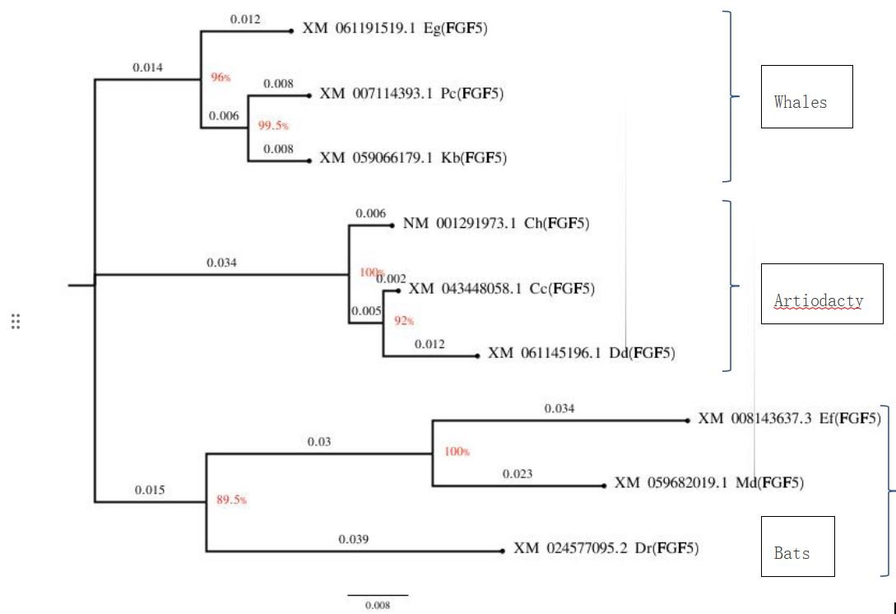
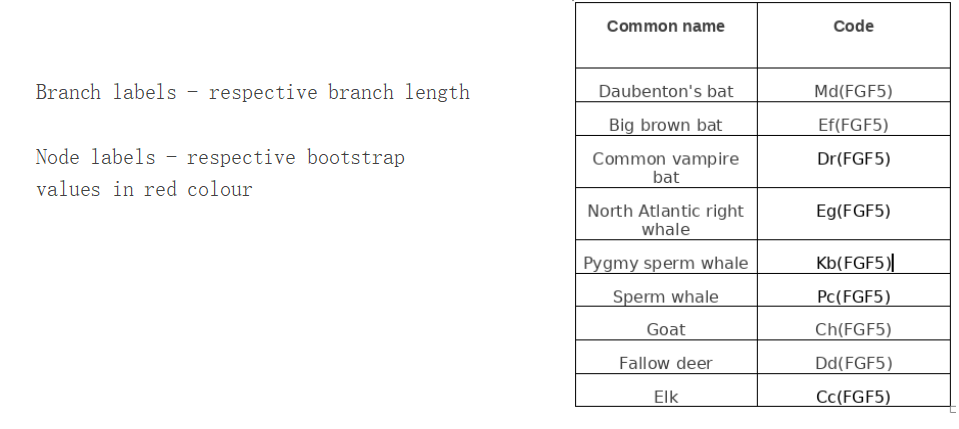

## Question
1. Investigate the evolutionary relationships among bats, whales, and artiodactyls (even-toed ungulates) groups.

a. Choose 3 to 5 species in each group. Menton each species, i. Name, ii. GenBank Accession Number, iii. Sequence Length & iv. Sequence.

b. Construct a phylogenetic tree using sequence data for the chosen species.

c. Analyze the tree to identify key evolutionary events and relationships in about 350 words.

d. Compare and contrast the evolutionary histories of the groups in about 250 words.

e. Discuss the implications of your findings for our understanding of mammalian evolution in about 150 words.

---

## Answers

### a. **Species Detail**

| **S.No.** | **Animal**                                              | **Common name**            | **Scientific name** | **GenBank Accession Number** | **Sequence Length** |
| --------- | ------------------------------------------------------- | -------------------------- | ------------------- | ---------------------------- | ------------------- |
| **1**     | Bats                                                    | Daubenton's bat            | Myotis daubentonii  | XM_059682019                 | 1274 bp             |
| **2**     | Big brown bat                                           | Eptesicus fuscus           | XM_008143637        | 857 bp                       |                     |
| **3**     | Common vampire bat                                      | Desmodus rotundus          | XM_024577095        | 1636 bp                      |                     |
| **4**     | whales                                                  | North Atlantic right whale | Eubalaena glacialis | XM_061191519                 | 813 bp              |
| **5**     | Pygmy sperm whale                                       | Kogia breviceps            | XM_059066179        | 1744 bp                      |                     |
| **6**     | Sperm whale                                             | Physeter catodon           | XM_007114393        | 1746 bp                      |                     |
| **7**     | Artiodactyls  (Even-toed ungulates)  Pecora | Goat                       | Capra hircus        | NM_001291973 XM_005681814    | 813 bp              |
| **8**     | Fallow deer                                             | Dama dama                  | XM_061145196        | 1539 bp                      |                     |
| **9**     | Elk                                                     | Cervus canadensis          | XM_043448058        | 1726 bp                      |                     |

Sequence details last page

**Common gene sequence for comparison and pylogenetic tree generation:** Fibroblast Growth Factor 5 (FGF5) Gene

---

### b. **Phylogenetic Tree**

**Figure 1:** **Pylogenetic Tree constructed based on** **Fibroblast Growth Factor 5 (FGF5) Gene**

---

### c. **Evolutionary events and relationships**

The  evolutionary relationships among **bats**, **whales**, and **artiodactyls** based on  the analysis of the **Fibroblast Growth Factor 5 (FGF5) gene**. The  analysis was conducted using the Maximum Likelihood method with a  Tamura-Nei model. The resulting phylogenetic tree shows that **bats** and  **whales** are more closely related to each other than to **artiodactyls**.The horizonal lines are branches and represent evolutionary lineages changing over time. The longer the branch in the horizonal dimension, the larger the amount of change. Within the **artiodactyls**, **goats** and **deer** are more closely related to each  other than to **elk**.

The **FGF5 gene** is associated with hair length in  mammals, and variations in this gene can lead to **differences in fur** or  **hair length** among species. The genetic variation in the FGF5 gene can be  studied to understand the **evolution of hair length** in different  mammalian lineages. The analysis of the FGF5 gene in bats, whales, and  artiodactyls can provide insights into the adaptive evolution of these  species in response to their respective environments and lifestyles. The  genetic basis of complex physical traits is often influenced by  multiple genes, but FGF5 is a suitable starting point for investigating  physical traits related to hair length in the chosen species.

---
### d. **Evolutionary History**

The evolutionary histories of bats, whales, and artiodactyls are different, but they are presumed to share some common ancestry (rooting). Bats and whales are both mammals, but they belong to different orders (Chiroptera and Cetacea, respectively). Artiodactyls are also mammals, but they belong to a different subclass (Eutheria) than bats and whales. Within the Artiodactyls, goats, deer, and elk belong to the same order (Artiodactyla), but they are different species. The analysis of the FGF5 gene shows that goats and deer are more closely related to each other than to elk. The differences in the evolutionary histories of these groups are reflected in their physical traits and adaptations to different environments and lifestyles.

---
### e. **Mammalian Evolution**

The analysis of the FGF5 gene provides **insights** into the  **adaptive evolution** of **bats**, **whales**, and **artiodactyls** in response to  their respective **environments** and **lifestyles**. The variations in fur or  hair length among these groups can be associated with adaptation to  different environments, climates, or ecological niches. The genetic  variation in the FGF5 gene can be studied to understand the evolution of  hair length in different mammalian lineages. However, it's important to  note that the genetic basis of complex physical traits is often  **influenced by multiple genes**, and the FGF5 gene is just one of many  genes that contribute to the observed differences in fur or hair length  among species. Overall, the analysis of the FGF5 gene provides a  starting point for investigating the evolution of physical traits  related to hair length in bats, whales, and artiodactyls.

---
