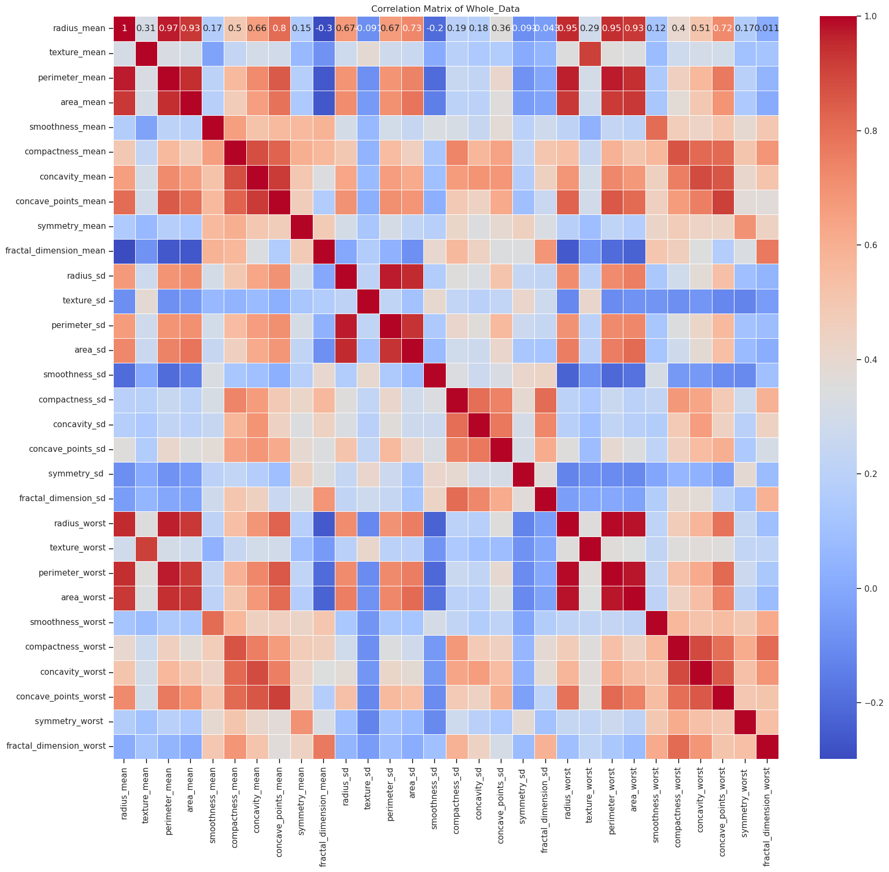

[[session_10]]

(David_Franklin_D)_ Bioinformatics Placement Program_(Python Exploratory Data analysis)
Title: Python Exploratory Data analysis
# Questions

Answer the following questions below and upload them in the google form.

1. How does the distribution of feature “fractal_dimension_worst” differ between benign and malignant cases?
2. What is the range of values for the feature “radius_mean” and how skewed is its distribution?
3. Are there any outliers in feature “area_mean” and how might they affect analysis?
4. Based on the EDA, what factors seem to be most relevant to predicting breast cancer diagnosis?
5. What limitations are there in the data, and how might they affect our conclusions?
---
## Data
	features = {id
		diagnosis
		radius_mean
		texture_mean
		perimeter_mean
		area_mean
		smoothness_mean
		compactness_mean
		concavity_mean
		concave_points_mean
		symmetry_mean
		fractal_dimension_mean
		radius_sd
		texture_sd
		perimeter_sd
		area_sd
		smoothness_sd
		compactness_sd
		concavity_sd
		concave_points_sd
		symmetry_sd 
		fractal_dimension_sd
		radius_worst
		texture_worst
		perimeter_worst
		area_worst
		smoothness_worst
		compactness_worst
		concavity_worst
		concave_points_worst
		symmetry_worst 
		fractal_dimension_worst}

## Answer

Step 0 : Importing functions
needed
	plot, comparision for question 1
	range, skewed for question 2
	outliners, for question 3
	coorlation between all the features and the cancer(benign and malignant) for question 4
	?? for question 5


---
step 0:
```python
import pandas as pd
import seaborn as sns
import matplotlib.pyplot as plt
```

```python
df = pd.read_csv('path to file')
```

- Checks
```python
df.head()
df.tail()
```

```python
df.diagnosis.unique()
df['diagnosis'].value_counts()
```
0.1 cleaning

```python
#Pandas converts 'NA' and null to NaN
#Adding missing values in a list that pandas is unable to identify
missing_value_formats = ["n.a.","?","NA","n/a", "na", "--"]
#Importing dataset
df = pd.read_csv("data.txt", na_values = missing_value_formats )
#Checking the dimensions of the data
print("Breast cancer data set dimensions : {}".format(df.shape))
```


removing the unwanted columns
```python
df.drop('id',axis=1,inplace=True)

df.drop('Unnamed: 32',axis=1,inplace=True)
```
-

0.1 Missing values imputation
```python
#Checking the number of missing values in each column
df.isnull().sum()
```

```python
#fraction of missing values in each column
df.isnull().sum() * 100 / len(df)
```
-> answer for 5th question

0.2 Checking the distrubution of the two features which contains missing data before imputing for the missing data
```python
#Getting the summary statistics of the radius_mean feature using describe
df["radius_mean"].describe()
df["area_mean"].describe()
```
-> answer for 5th question

```python
#fraction of missing values in each column
df.isnull().sum() * 100 / len(df)
```

```python
# Imputating the missing values
df['radius_mean'].fillna(df['radius_mean'].mean(), inplace=True)
df['area_mean'].fillna(df['area_mean'].mean(), inplace=True)

```
--->outliers

1. Distribution of "fractal_dimension_worst"
```python
import seaborn as sns
import matplotlib.pyplot as plt

# distribution difference
sns.boxplot(x='diagnosis', y='fractal_dimension_worst', data=df)
plt.title('Distribution of fractal_dimension_worst between Benign and Malignant cases')
plt.show()

```

2. Range and Skewness of "radius_mean"
```python
# Range
range_radius_mean = df['radius_mean'].max() - df['radius_mean'].min()

# Skewness
skewness_radius_mean = df['radius_mean'].skew()

print(f"Range of radius_mean: {range_radius_mean}")
print(f"Skewness of radius_mean: {skewness_radius_mean}")
```

3. Outliers in "area_mean" and their impact
```python
df["area_mean"].describe()
```

```python
# Boxplot to identify outliers
sns.boxplot(x='area_mean', data=df)
plt.title('Boxplot of area_mean')
plt.show()
```

```python
#Histogram and boxplot to visualize the distribution of the data and detection of outliers

sns.set(style="ticks")
f, (ax_box, ax_hist) = plt.subplots(2, sharex=True, 
                                    gridspec_kw={"height_ratios": (.20, .90)})
sns.boxplot(df["area_mean"], ax =  ax_box, color = "blue")
sns.histplot(df["area_mean"],ax = ax_hist,  kde = True , color = "blue")


# Labeling the x-axis
ax_hist.set_xlabel("Area Mean", fontsize=12)

ax_box.set(yticks=[])
sns.despine(ax=ax_hist)
sns.despine(ax=ax_box)

plt.show()
```

x axis
```python
# Assuming df is your DataFrame

sns.set(style="ticks")
f, (ax_box, ax_hist) = plt.subplots(2, sharex=False, 
                                    gridspec_kw={"height_ratios": (.20, .90)})

sns.boxplot(df["area_mean"], ax=ax_box, color="blue")
sns.histplot(df["area_mean"], ax=ax_hist, kde=True, color="blue")

ax_box.set(yticks=[])
sns.despine(ax=ax_hist)
sns.despine(ax=ax_box)

plt.show()

```
check graph before and after
```python
# Impact on analysis
## Identify outliers using the IQR method
outliers = df[df['area_mean'] > (1.5 * df['area_mean'].quantile(0.75))]

## Print the identified outliers
print("Outliers in area_mean:")
print(outliers)

```
- `1.5 * df['area_mean'].quantile(0.75)`: Calculates the upper bound for outliers using the IQR method.
- `df[df['area_mean'] > (1.5 * df['area_mean'].quantile(0.75))]`: Selects rows in the DataFrame where the 'area_mean' values are greater than the calculated upper bound, identifying outliers.

 or
```python
# Assuming df is your original DataFrame
outlier_upper_bound = 1.5 * df['area_mean'].quantile(0.75)

# Create a new DataFrame without outliers
df_outlierRemove = df.loc[df['area_mean'] <= outlier_upper_bound]

# Display descriptive statistics for the 'area_mean' column in the new DataFrame
print(df_outlierRemove["area_mean"].describe())

```

```python
outlier_upper_bound = 1.5 * df['area_mean'].quantile(0.75)

# Count the number of outliers
num_outliers = len(df[df['area_mean'] > outlier_upper_bound])

# Print the number of outliers
print("Number of outliers in area_mean:", num_outliers)

```


1. Factors relevant to predicting breast cancer diagnosis

You can use correlation or pair plots to visualize relationships between features and diagnosis.
ValueError: could not convert string to float: 'M'
So

```python
# Correlation matrix
corr_matrix = df.corr()
sns.heatmap(corr_matrix[['diagnosis']], annot=True, cmap='coolwarm')
plt.title('Correlation with Diagnosis')
plt.show()

```

with pairplot
```python
import seaborn as sns
import matplotlib.pyplot as plt

# Assuming your DataFrame is named 'df'
# Add any necessary data preprocessing steps here

# Select relevant columns for pairplot
columns_for_pairplot = ['diagnosis', 'radius_mean', 'texture_mean', 'perimeter_mean', 'area_mean',
                        'smoothness_mean', 'compactness_mean', 'concavity_mean', 'concave_points_mean',
                        'symmetry_mean', 'fractal_dimension_mean']

# Create pairplot
sns.pairplot(df[columns_for_pairplot], hue='diagnosis', diag_kind='kde')
plt.suptitle("Pairplot of Features with Diagnosis", y=1.02)
plt.show()

```

5. Limitations in the data
```python
# Check for missing values
missing_values = df.isnull().sum()

# Consider class distribution
class_distribution = df['diagnosis'].value_counts()

print("Missing Values:")
print(missing_values)
print("\nClass Distribution:")
print(class_distribution)

```


---
Answers --> word doc

## 5.
Missing Values:
radius_mean 28
area_mean 41

diagnosis 
B 357 
M 212 
Name: count, dtype: int64

radius_mean

 


area_mean

    


The fraction of missing values in a dataset is a measure that indicates the proportion of data points that are not available for a particular variable. The fraction of missing values is a useful metric for understanding the quality and completeness of a dataset.
1. **Data Quality Assessment:**
    
    - High fractions of missing values may indicate issues with data collection, recording, or storage. Assessing the fraction of missing values helps in identifying potential data quality issues.
2. **Impact on Analysis:**
    
    - Missing values can impact the statistical analysis and machine learning models. Understanding the fraction of missing values is crucial for determining the potential impact on the results of an analysis or model.
3. **Data Imputation Strategies:**
    
    - When dealing with missing values, it's essential to choose an appropriate imputation strategy. The fraction of missing values can guide decisions on whether to drop variables or observations with missing values, impute missing values using statistical methods, or use more advanced imputation techniques.
4. **Variable Selection:**
    
    - Variables with a high fraction of missing values may be candidates for exclusion from the analysis, especially if the missing values are not missing completely at random. Choosing relevant variables is important for meaningful analysis.
5. **Communication and Reporting:**
    
    - Communicating the fraction of missing values is important when sharing or reporting results. It provides transparency about the data quality and limitations of the analysis.

### Fraction of missing values:

	radius_mean 4.920914
	area_mean 7.205624

#### what to do 
Both percentages are below 10%, indicating that a relatively small proportion of data is missing for these variables. In many cases, data analysts and researchers are generally comfortable handling missing data when it's at this level.Given the low percentage of missing values, you may consider imputation to fill in the missing data using appropriate methods. Common imputation methods include mean or median imputation, especially if the missingness is random.

- **Fraction of Missing Values:**
    
    - The fractions you mentioned are relatively small, which is generally positive. Having a small percentage of missing values may have a limited impact on the overall dataset.
- **Impact on Descriptive Statistics:**
    
    - If you choose to impute the missing values, it may influence the descriptive statistics of the affected columns. The mean, median, and other statistical measures will be affected by the imputation strategy.
- **Impact on Relationships:**
    
    - The presence of missing values might impact the relationships between variables. Imputing values introduces a level of uncertainty, and the relationships observed in the imputed dataset might not accurately reflect the true relationships in the original data.

## 3.
### Outliners in area mean

Number of outliers in area_mean: 63
using IQR method
 -->


Visual removal metod
```
a=df.loc[df['area_mean'] < 1500]
```


### Outliners in radius mean
Number of outliers in radius_mean: 7

IQR method
-->


## 1. 
as bar plot


kdeplot


## 2. 

Range of radius_mean: 21.128999999999998 
Skewness of radius_mean: 0.9691474537921837


If the skewness value is positive, it indicates a right-skewed distribution (long tail on the right). If the skewness value is negative, it indicates a left-skewed distribution (long tail on the left).

The data shows a right-skewed distribution.

Outliners removed

The data shows a right-skewed distribution.
## 4
Correlation for whole


Correlation for B


Corrleation for M

For example, if the correlation coefficient for a feature is close to 1 or -1, it indicates a strong linear relationship with the diagnosis, making it more relevant for prediction


```python
df = pd.read_csv('data.txt')
#Imputating the missing values

df['radius_mean'].fillna(df['radius_mean'].mean(), inplace=True)

df['area_mean'].fillna(df['area_mean'].mean(), inplace=True)

  

# Convert 'diagnosis' to binary values (0 for 'B' and 1 for 'M')

df['diagnosis_binary'] = df['diagnosis'].map({'B': 0, 'M': 1})


# Assuming your DataFrame is named 'df'

  

  

# Create separate DataFrames for benign (B) and malignant (M) cases

  

df_B = df[df['diagnosis'] == 'B'].copy()

  

df_M = df[df['diagnosis'] == 'M'].copy()

  

# Drop 'diagnosis' and 'diagnosis_binary' columns from the new DataFrames if needed

  

df_B.drop(['diagnosis', 'id'], axis=1, inplace=True)

  

df_M.drop(['diagnosis', 'id'], axis=1, inplace=True)

# Calculate correlation matrix for df_B

  

corr_matrix_B = df_B.corr()

  

# saving rank

  

# Assuming your correlation matrix is named 'corr_matrix_B'

  

correlation_with_target = corr_matrix_B['diagnosis_binary'].abs().sort_values(ascending=False)

  

  

# Save the ranked features to a CSV file

  

correlation_with_target.to_csv('feature_ranking_B.csv')

  

  

# Display a message indicating that the file has been saved

  

print("Ranked Features based on Correlation with Diagnosis saved to 'feature_ranking_B.csv'")

from sklearn.ensemble import RandomForestClassifier

import pandas as pd

  

# Assuming df_B is your DataFrame and 'diagnosis_binary' is the target variable

X = df_B.drop('diagnosis_binary', axis=1) # Features

y = df_B['diagnosis_binary'] # Target variable

  

# Create a Random Forest classifier

rf_classifier = RandomForestClassifier(random_state=42)

rf_classifier.fit(X, y)

  

# Get feature importances from the trained model

feature_importances = pd.Series(rf_classifier.feature_importances_, index=X.columns)

  

# Rank features based on importance

ranked_features = feature_importances.sort_values(ascending=False)

  

# Save the ranked features to a CSV file

ranked_features.to_csv('feature_ranking_random_forest.csv')

  

# Display a message indicating that the file has been saved

print("Ranked Features based on Random Forest Feature Importance saved to 'feature_ranking_random_forest.csv'")
```


```python
df = pd.read_csv('data.txt')
#Imputating the missing values

df['radius_mean'].fillna(df['radius_mean'].mean(), inplace=True)

df['area_mean'].fillna(df['area_mean'].mean(), inplace=True)

  

# Convert 'diagnosis' to binary values (0 for 'B' and 1 for 'M')

df['diagnosis_binary'] = df['diagnosis'].map({'B': 0, 'M': 1})


# Assuming your DataFrame is named 'df'

  

  

# Create separate DataFrames for benign (B) and malignant (M) cases

  

df_M = df[df['diagnosis'] == 'B'].copy()

  

df_M = df[df['diagnosis'] == 'M'].copy()

  

# Drop 'diagnosis' and 'diagnosis_binary' columns from the new DataFrames if needed

  

df_M.drop(['diagnosis', 'id'], axis=1, inplace=True)

  

df_M.drop(['diagnosis', 'id'], axis=1, inplace=True)

# Calculate correlation matrix for df_M

  

corr_matrix_M = df_M.corr()

  

# saving rank

  

# Assuming your correlation matrix is named 'corr_matrix_M'

  

correlation_with_target = corr_matrix_M['diagnosis_binary'].abs().sort_values(ascending=False)

  

  

# Save the ranked features to a CSV file

  

correlation_with_target.to_csv('feature_ranking_M.csv')

  

  

# Display a message indicating that the file has been saved

  

print("Ranked Features based on Correlation with Diagnosis saved to 'feature_ranking_M.csv'")

from sklearn.ensemble import RandomForestClassifier

import pandas as pd

  

# Assuming df_M is your DataFrame and 'diagnosis_binary' is the target variable

X = df_M.drop('diagnosis_binary', axis=1) # Features

y = df_M['diagnosis_binary'] # Target variable

  

# Create a Random Forest classifier

rf_classifier = RandomForestClassifier(random_state=42)

rf_classifier.fit(X, y)

  

# Get feature importances from the trained model

feature_importances = pd.Series(rf_classifier.feature_importances_, index=X.columns)

  

# Rank features based on importance

ranked_features = feature_importances.sort_values(ascending=False)

  

# Save the ranked features to a CSV file

ranked_features.to_csv('feature_ranking_random_forest.csv')

  

# Display a message indicating that the file has been saved

print("Ranked Features based on Random Forest Feature Importance saved to 'feature_ranking_random_forest.csv'")
```

---
