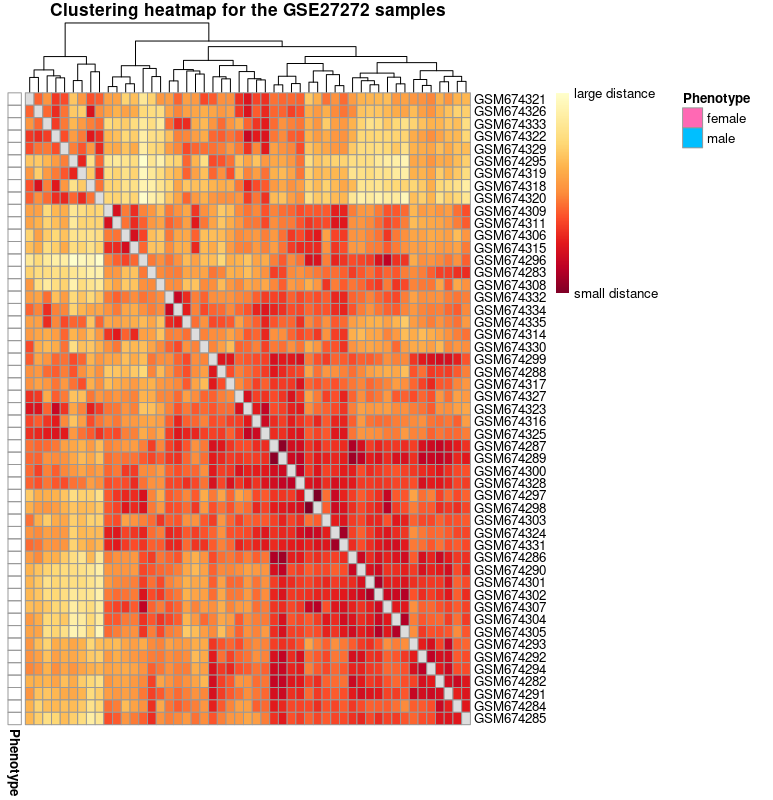
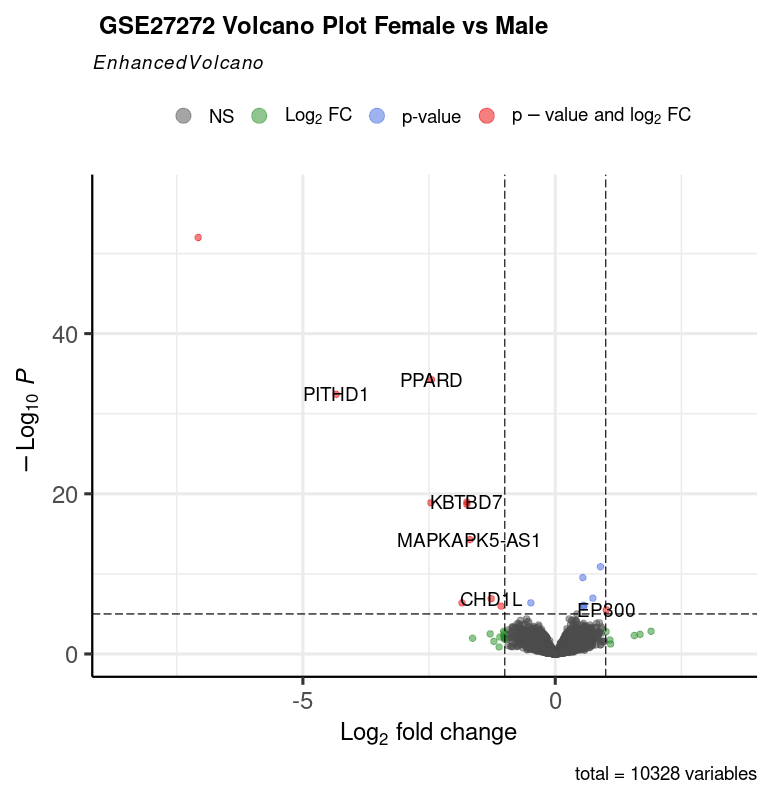
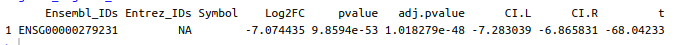
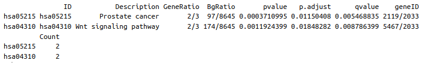

(David_Franklin_D)_ Bioinformatics Placement Program_(R for Differential Gene Expression analysis)
Name : David Franklin D.
Batch : #1 
Contact: davidfranklin1999@gmail.com
Mobile: 7339695655
Assignment : 5
Title: R for Differential Gene Expression analysis
## Questions
Answer the following questions below and upload them in the google form.

1. Describe the steps involved in importing the microarray data into R and Bioconductor packages.
2. Explain the code used to filter genes based on expression levels or other criteria.
3. Outline the statistical test used for the differential expression analysis and explain its purpose and limitations.
4. Visualize the differential expression results using heatmaps.
5. Analyze the results of the differential expression analysis. How many genes are significantly differentially expressed by fetal sex? Which genes have the highest fold change?
6. Based on the findings, discuss potential biological implications of the differentially expressed genes in the context of fetal sex and tobacco smoke exposure.
---
# 1. Importing Microarray Data into R and Bioconductor Packages:

To import microarray data into R, you can use the affy or limma packages in Bioconductor. Here are the general steps:
## Step 1:  Install and load necessary packages:
For packages needed to be installed 
```R
install.packages("package_name")
```

For loading a package,
```R
library(package_name)
```
can be used. Only installed packages can be loaded.

Packages loaded to analyse  Microarray Data in R
```R
library(Biobase)
library(limma)
library(geneplotter)
library(enrichplot)
library(pheatmap)
library(ggplot2)
library(RColorBrewer)
library(ggrepel)
library(EnhancedVolcano)
library(clusterProfiler)
```
### Explaination
1. **Biobase:**
    
    - **Description:** Provides the core infrastructure and S4 classes for representing and manipulating high-throughput biological data in R.
2. **limma:**
    
    - **Description:** A package for the analysis of gene expression data, especially the use of linear models for assessing differential expression.
3. **geneplotter:**
    
    - **Description:** Provides functions for plotting genomic data, including functions for visualizing genomic ranges and annotation data.
4. **enrichplot:**
    
    - **Description:** Enables the visualization of enrichment results obtained from functional enrichment analyses.
5. **pheatmap:**
    
    - **Description:** Creates pretty heatmaps for visualizing high-dimensional data, especially useful for gene expression data.
6. **ggplot2:**
    
    - **Description:** A powerful and flexible package for creating static, animated, and interactive visualizations using the Grammar of Graphics.
7. **RColorBrewer:**
    
    - **Description:** Provides color palettes for creating visually appealing plots.
8. **ggrepel:**
    
    - **Description:** Enhances the `ggplot2` package by providing functions to avoid overlapping text labels in plots.
9. **EnhancedVolcano:**
    
    - **Description:** Generates enhanced volcano plots for visualizing differential expression analysis results.
10. **clusterProfiler:**
    
    - **Description:** Performs gene set enrichment analysis and visualization, helping to interpret high-throughput genomics data.

These packages are commonly used in bioinformatics and genomics research for analyzing, visualizing, and interpreting various types of high-throughput biological data. Each package has its specific functionalities that contribute to different steps of the analysis workflow.


## Step 2: Read in the microarray data:
```R
# For Affymetrix data
data <- ReadAffy()
```
or
```R
# Replace paths with your actual file paths
exprsData <- read.delim("path/to/expression_data.txt")
phenoData <- read.delim("path/to/phenotype_data.txt")
featureData <- read.delim("path/to/feature_annotation.txt")

```
In R, the function for reading tab-delimited files (with `.txt` extension) is typically `read.delim()`, and it is part of the base R package. The `delim` in `read.delim` stands for "delimiter," and it's used to specify that the function should expect tab-delimited data.


---

# 2. Filtering Genes Based on Expression Levels or Other Criteria:

Filtering genes is crucial to reduce noise and focus on relevant signals. filter genes based on expression levels, variability, or other criteria. Here's a simplified example using expression levels:

## Filter genes based on expression levels
Based on expression levels:
```R

filtered_data <- exprs(data)[rowMeans(exprs(data)) > threshold, ]
```
Explanation:

1. `exprs(data)`: This extracts the expression matrix from the `data` object. The `exprs` function is commonly used to retrieve the expression data from various genomic data structures.
    
2. `rowMeans(exprs(data))`: This calculates the mean expression value across all samples for each gene. `rowMeans` computes the mean along rows of the expression matrix, providing a vector of mean expression values, one for each gene.
    
3. `rowMeans(exprs(data)) > threshold`: This creates a logical vector where each element is `TRUE` if the mean expression value for the corresponding gene is greater than the specified threshold, and `FALSE` otherwise.
    
4. `exprs(data)[rowMeans(exprs(data)) > threshold, ]`: This is used to subset the expression matrix based on the condition defined by the logical vector. It keeps only those rows (genes) for which the mean expression is greater than the threshold.
    

In summary, the code filters genes based on their mean expression values across samples. Genes with a mean expression greater than the specified threshold are retained in the `filtered_data`. This type of filtering is often used to focus on genes that are expressed above a certain level across multiple samples.

Based on the presence of Y chromosome:
```R
# Filters the ExpressionSet (which includes the feature data and the expression data)
# to the genes that are not present in the Y chromosome
GSE27272_noY <-GSE27272_Eset[GSE27272_Eset@featureData@data$CHR!="Y",]
```
Explanation:

- `GSE27272_Eset` is assumed to be an ExpressionSet object, a data structure used in Bioconductor for representing and manipulating high-throughput genomic data.
- `GSE27272_Eset@featureData@data$CHR != "Y",]` is used to subset the expression set based on the condition that genes located on the Y chromosome should be excluded.
- The resulting subset, containing genes not present on the Y chromosome, is stored in the variable `GSE27272_noY`.

This type of filtering can be useful in differential gene expression analysis, especially if you are focusing on autosomal genes and want to exclude sex chromosomes from the analysis.

----

# 3. Statistical Test for Differential Expression Analysis:

Commonly used tests include limma's moderated t-test or ANOVA. These tests identify genes that are differentially expressed between groups. They are used to assess whether the mean expression of a gene differs significantly between conditions. Limitations include potential issues with multiple testing correction.
The statistical test commonly used for differential expression analysis, particularly in the context of microarray or RNA-Seq data, is the moderated t-test. This test is employed to identify genes that exhibit significant differences in expression between two or more experimental conditions. The specific implementation of the moderated t-test often involves empirical Bayes methods, and one popular tool for this purpose is the limma (Linear Models for Microarray Data) package in Bioconductor.

### Purpose of the Moderated T-Test:

1. **Identification of Differentially Expressed Genes (DEGs):**
    
    - The primary purpose is to identify genes whose expression levels differ significantly between experimental conditions (e.g., different groups, treatments, or biological states).
    - It helps researchers pinpoint genes that may play a role in the biological processes under investigation.
2. **Accounting for Small Sample Sizes:**
    
    - The moderated t-test is advantageous when dealing with small sample sizes. It borrows information across genes, making it more robust and reliable, especially when the number of replicates is limited.
3. **Handling Variability:**
    
    - The empirical Bayes shrinkage technique is applied to moderate the gene-wise variances, reducing the impact of outliers and providing more stable estimates of fold changes.

### Limitations of the Moderated T-Test:

1. **Assumes Normality:**
    
    - Like other parametric tests, the moderated t-test assumes that the gene expression values follow a normal distribution. If the data violate this assumption, it might lead to inaccurate results.
2. **Dependence on Correct Model Specification:**
    
    - The effectiveness of the test relies on the correct specification of the statistical model, including the inclusion of relevant covariates and factors. Incorrect model specification can lead to biased results.
3. **Multiple Testing Issues:**
    
    - In high-throughput data analyses, such as microarray studies, where thousands of genes are tested simultaneously, the issue of multiple testing arises. Without correction methods (e.g., False Discovery Rate correction), the likelihood of obtaining false positives increases.
4. **Sensitivity to Outliers:**
    
    - Extreme outliers in the data can have a considerable impact on the results. While empirical Bayes shrinkage helps mitigate this effect to some extent, it does not completely eliminate the sensitivity to outliers.

In summary, the moderated t-test is a valuable tool for identifying differentially expressed genes, especially in scenarios with limited samples. Researchers should be mindful of its assumptions and limitations and consider complementary analyses and validation methods to ensure robust and reliable findings.

---

# 4. Visualizing Differential Expression Results Using Heatmaps:

Heatmaps provide a visual representation of gene expression patterns. The heatmap function in R can be used:

```R
# Creating an annotation dataframe for heatmap
annotation_for_heatmap <- data.frame(Phenotype = Biobase::pData(GSE27272_Eset)$sex)
row.names(annotation_for_heatmap) <- row.names(pData(GSE27272_Eset))

# Calculating sample-to-sample distances using Manhattan method
dists <- as.matrix(dist(t(GSE27272_exprs), method = "manhattan"))
rownames(dists) <- row.names(pData(GSE27272_Eset))

# Defining colors for the heatmap
hmcol <- rev(colorRampPalette(RColorBrewer::brewer.pal(9, "YlOrRd"))(255))

# Setting up distance matrix properties
colnames(dists) <- NULL
diag(dists) <- NA

# Defining annotation colors for sex
ann_colors <- list(
  Phenotype = c(female = "hotpink", male = "deepskyblue")
)

# Plotting the heatmap using pheatmap
pheatmap(dists, col = hmcol,
         annotation_row = annotation_for_heatmap,
         annotation_colors = ann_colors,
         legend = TRUE,
         treeheight_row = 0,
         legend_breaks = c(min(dists, na.rm = TRUE),
                           max(dists, na.rm = TRUE)),
         legend_labels = c("small distance", "large distance"),
         main = "Clustering heatmap for the GSE27272 samples")

```
Output:
Clustering heatmap for the samples


Explanation:

1. **Annotation Dataframe**: `annotation_for_heatmap` is created to provide phenotype information (sex) for each sample in the heatmap.
    
2. **Sample-to-Sample Distances**: Manhattan distance is calculated between samples using the `dist` function.
    
3. **Color Setup**: Colors for the heatmap are defined using the YlOrRd color palette.
    
4. **Distance Matrix Adjustments**: Row and column names and diagonal values are set to prepare the distance matrix for plotting.
    
5. **Annotation Colors**: Colors for annotation (sex) are defined.
    
6. **Heatmap Plotting**: The `pheatmap` function is used to create the heatmap, considering the distance matrix, annotation information, colors, and legend settings.
    

This heatmap is designed to visualize the distances between samples and observe how well samples cluster based on sex. The color scheme and annotations enhance the interpretability of the heatmap.

----


# 5. Analyzing Differential Expression Results:
A gene is statistically significant after mutliple testing correction if it has an adjusted p value less than .05 . The log2 fold change determines if a gene has a biologically significant change in expression (or a gene having a meaningful effect size) between both groups.
Log2 fold change determines whether a gene is upregulated or downregulated with respect to the reference group, which is placenta of female fetuses. If log2 fold change is greater than 0, then the gene expression is higher in placenta of female fetuses compared placenta of a male fetuses. On the other hand, if the log2 fold change is less than 0, then the gene expression is lower in the placentas of female fetus compared to male. If a gene's log2 fold change is too close to zero in either direction, it is hard to claim that there is a biologically meaningful effect in
the genes expression with respect to fetal sex, regardless of the statistical significance of the gene. Therefore, it's important to set a threshold to determine whether gene has a biological signficant effect size.



For the volcano plot produced using EnhancedVolcano, all of the genes shown in gray are non-significant both statistically and in effect size. The genes in blue have statistically significant p-values but didn't a log2 fold change that suggests biologically significance. The green labeled genes aren't statistically significant but has a biologically meaningful log2 fold change. The genes colored in red are both statistically significant and has a biologically meaningful effect size.

The significant genes are 


The gene with the highest absolute log2 fold change is


# 6. Biological Implications:

We can explore the biological functions of significant genes using databases like GO or KEGG. Discuss potential implications based on known functions of these genes in the context of fetal sex and tobacco smoke exposure.

#### Analysis:

**Selection:**
Entrez IDs of genes that are significantly differentially expressed based on the criteria:
- Adjusted p-value (`adj.pvalue`) less than 0.05
- The absolute value of Log2 fold change (`Log2FC`) greater than 1
- Excludes NA values in adjusted p-values
- This ensures that any genes with missing values are excluded from the subsequent analysis
are selected.
 **Enrichment Analysis (KEGG):**
- The Kyoto Encyclopedia of Genes and Genomes (KEGG) pathway enrichment analysis using the `enrichKEGG` function from the `clusterProfiler` package.
- The `gene` parameter is set to the vector of Entrez IDs (`sigGenes`).
- The `organism` parameter is set to 'hsa', indicating the analysis is performed for the human genome.


**Here is the results**



#### over-representation test
#
#...@organism 	 hsa 
#...@ontology 	 KEGG 
#...@keytype 	 kegg 
#...@gene 	 chr [1:8] "5467" "57095" "84078" "83877" "440400" "9557" "2119" "2033"
#...pvalues adjusted by 'BH' with cutoff <0.05 
#...2 enriched terms found
'data.frame':	2 obs. of  9 variables:
 $ ID         : chr  "hsa05215" "hsa04310"
 $ Description: chr  "Prostate cancer" "Wnt signaling pathway"
 $ GeneRatio  : chr  "2/3" "2/3"
 $ BgRatio    : chr  "97/8645" "174/8645"
 $ pvalue     : num  0.000371 0.001192
 $ p.adjust   : num  0.0115 0.0185
 $ qvalue     : num  0.00547 0.00879
 $ geneID     : chr  "2119/2033" "5467/2033"
 $ Count      : int  2 2

#...Citation
 T Wu, E Hu, S Xu, M Chen, P Guo, Z Dai, T Feng, L Zhou, W Tang, L Zhan, X Fu, S Liu, X Bo, and G Yu.
 clusterProfiler 4.0: A universal enrichment tool for interpreting omics data.
 The Innovation. 2021, 2(3):100141


#### **Conclusion**:

The output of the over-representation test suggests that there are two significantly enriched KEGG pathways among the differentially expressed genes associated with fetal sex. Here are the pathways:

1. **Prostate Cancer (hsa05215):**
    
    - **Gene Ratio:** 2 out of 3 genes in the input are associated with this pathway.
    - **Background Ratio:** 97 out of 8645 genes in the genome are associated with this pathway.
    - **P-value:** 0.000371 (adjusted p-value: 0.0115)
2. **Wnt Signaling Pathway (hsa04310):**
    
    - **Gene Ratio:** 2 out of 3 genes in the input are associated with this pathway.
    - **Background Ratio:** 174 out of 8645 genes in the genome are associated with this pathway.
    - **P-value:** 0.001192 (adjusted p-value: 0.0185)

**Biological Implications:**

1. **Prostate Cancer Pathway:**
    
    - The enrichment of genes related to the Prostate Cancer pathway suggests a potential association with fetal sex differences. It might indicate that certain genes involved in the Prostate Cancer pathway are differentially expressed in the placenta depending on the fetal sex.
2. **Wnt Signaling Pathway:**
    
    - The Wnt signaling pathway is a crucial pathway involved in various biological processes, including embryonic development, tissue regeneration, and cancer. The differential expression of genes in the Wnt signaling pathway could imply sex-specific regulatory mechanisms in placental development or response to tobacco smoke exposure.

**Considerations:**

- It's important to note that these findings are based on the assumption that the genes associated with these pathways are functionally relevant in the context of fetal sex and tobacco smoke exposure.
- Further experimental validation and functional studies are needed to confirm the role of these genes and pathways in the placental response to fetal sex and tobacco smoke exposure.
------
