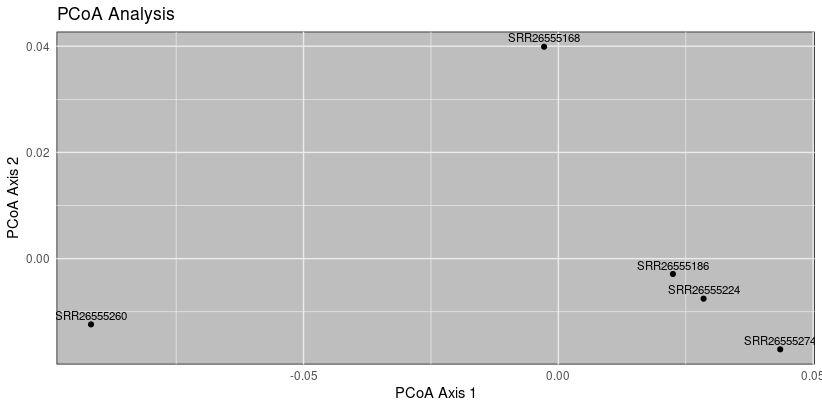

File name: (David_Franklin_D)_ Bioinformatics Placement Program_(Biological Network and Pathway analysis)

Name : David Franklin D.
Batch : #1 
Contact: davidfranklin1999@gmail.com
Mobile: 7339695655
Assignment : 6
Title: Biological Network and Pathway analysis

## Questions:
Answer the following questions below and upload them in the google form.

  
1. Make a co-expression network for the below data.

| id  | Co-expression  | Node  |
|---|---|---|
|DCN|0.597|MGP|
|DCN|0.416|LYVE1|
|DCN|0.517|PRELP|
|DCN|0.72|THBS2|
|DCN|0.419|TNXB|
|MGP|0.435|GPX3|
|MGP|0.447|EFEMP1|
|IL1A|0.958|CXCL10|
|IL1A|0.452|OLR1|
|TNC|0.408|EMILIN1|
|TNC|0.542|TNXB|
|MAP1B|0.461|DPYSL3|
|MAP1B|0.442|DMD|
|CXCL10|0.475|OLR1|
|CAVIN2|0.728|CAVIN1|
|ZBTB16|0.73|GFRA1|
|PRELP|0.607|THBS2|
|PRELP|0.459|MFAP4|
|PRELP|0.429|PODN|
|PRELP|0.566|FBLN2|
|SMOC2|0.431|THBS2|
|CAVIN1|0.644|DMD|
|LAMC3|0.522|DMD|
|THBS2|0.47|EFEMP1|
|THBS2|0.421|FBLN2|
|EMILIN1|0.432|FBLN2|
|EFEMP1|0.784|MFAP4|
|MFAP4|0.73|FBLN2a|

2. Download any metagenome sequence (16s rRNA) from NCBI GEO and its metadata and analyze using QIIME2 tool, import sequences into cassava format.
   
3. Download any metagenome sequence from NCBI GEO and analyze using the MOTHUR tool.
    
4. Download GSE250315 dataset from NCBI GEO, download gene expression matrix and calculate co expression values between genes and make gene networks using string database.
    
	`“Incase, if the data is too large to use, make use of only a few genes. Use string to calculate co-expression between genes.”`

5. What conclusion should be made with respect to an experiment when the significance level is 0.068? In which of the following cases would you use a paired-samples t-test?

	1. When comparing the same participant's performance before and after training.
	    
	2. When comparing two separate groups of people.

---

# *1. co-expression network for the given data*

**Network constructed using Cytoscape**
****
 **Figure 1.1:** co-expression network using Cytoscape
 Node size is proportional to the co-expression.

**Network constructed using string database**

**Figure 1.2**: co-expression network using String database

-----

# *2. QIIME2 -Metagenome analysis*
***synopsis***

### Prepared data

**Table 2.1: Containing the information on the data that was used for this analysis**

| S.no | sample-id | Isolation source | Organism |
| ---- | ---- | ---- | ---- |
| 1 | SRR27317139 | Adult | mosquito metagenome |
| 2 | SRR27317141 | Larval_Water | mosquito metagenome |
| 3 | SRR27317143 | Adult | mosquito metagenome |
| 4 | SRR27317150 | Adult | mosquito metagenome |
| 5 | SRR27317161 | Adult | mosquito metagenome |
The data was acquired from NCBI database.

## **Analysis**
### **1. Quality Control and Overview**:
##### Demultiplexed Sequence Counts Summary:

#### Forward Sequence Count and Reverse Sequence Count:

**Figure 2.1 : Histogram plots of the quality**

**Quality plot** 

These summaries provide information about the sequence counts, quality scores, and lengths in the dataset, aiding in quality control and overview of the sequencing data.

#### Metadata

**Table 2.2: The metadata of the data**

| sample-id    | Isolation source | input    | filtered    | percentage of input passed filter    | denoised    | merged    | percentage of input merged    | non-chimeric    | percentage of input non-chimeric    |
| ---- | ---- | ---- | ---- | ---- | ---- | ---- | ---- | ---- | ---- |
| #q2:types | categorical | numeric | numeric | numeric | numeric | numeric | numeric | numeric | numeric |
| SRR27317139 | Adult | 64820 | 60939 | 94.01 | 60866 | 60699 | 93.64 | 59062 | 91.12 |
| SRR27317141 | larval-_water | 37854 | 33230 | 87.78 | 32963 | 31896 | 84.26 | 25358 | 66.99 |
| SRR27317143 | Adult | 66808 | 62541 | 93.61 | 62487 | 62392 | 93.39 | 62162 | 93.05 |
| SRR27317150 | Adult | 58713 | 52933 | 90.16 | 52883 | 52787 | 89.91 | 49736 | 84.71 |
| SRR27317161 | Adult | 13294 | 12288 | 92.43 | 12261 | 12151 | 91.4 | 12150 | 91.39 |

The stats data was visualized after denoising and triming the sequences.

#### Feature Table and Feature Data Summaries

**Table 2.3: Table summary**

|Metric|Sample|
|---|---|
|Number of samples|5|
|Number of features|270|
|Total frequency|208,468|
This table provides basic statistics about the dataset. You have 5 samples, 270 features, and the total frequency (which could represent the total number of occurrences or abundance of features across all samples) is 208,468.

**Table 2.4: Sequence Length Statistics**

|Sequence Count|Min Length|Max Length|Mean Length|Range|Standard Deviation|
|---|---|---|---|---|---|
|270|228|437|426.86|209|26.44|
These statistics describe the lengths of sequences in the dataset. You have 270 sequences, and the lengths vary from a minimum of 228 to a maximum of 437. The mean length is 426.86, and the standard deviation is 26.44, indicating the degree of variability in sequence lengths.

**Table 2.5: Seven-Number Summary of Sequence Lengths**

|Percentile:|2%|9%|25%|50%|75%|91%|98%|
|---|---|---|---|---|---|---|---|
|Length* (nts):|327|410|433|434|435|435|436|
This table provides a more detailed view of the distribution of sequence lengths. For example, the 50th percentile (median) is 434 nucleotides (nts), and the 75th percentile is 435 nts. These percentiles give you an idea of the central tendency and spread of the sequence lengths.

In summary, these tables offer insights into the composition and characteristics of the dataset, including the number of samples, features, and detailed statistics on sequence lengths.

###  **2. Alpha Diversity Analysis:**

**Alpha Diversity Boxplots**

x-axis --> faith_pd,   y-axis --> larval-water
**Figure 2.2 (a) : Alpha Diversity Boxplots based on Isolation-source(host). **

x-axis --> faith_pd,   y-axis --> larval-water
**Figure 2.2 (a) : Evenness -Alpha Diversity Boxplots based on Isolation-source(host). **

**Kruskal-Wallis (all groups)**

|  | Results |
| ---- | ---- |
| H | 0 |
| p-value | 1 |
- H: The test statistic (a measure of the difference between groups).
    
- p-value: The probability of observing a test statistic as extreme as the one computed from the sample data, assuming that the null hypothesis is true.
    
    In this case, the p-value is 1, which means that there is no evidence to reject the null hypothesis. This suggests that there are no significant differences between the groups.
    
**Kruskal-Wallis (pairwise)**

|  |  | H | p-value | q-value |
| ---- | ---- | ---- | ---- | ---- |
| Group 1 | Group 2 |  |  |  |
| adult (n=4) | larval-water (n=1) | 0.0 | 1.0 | 1.0 |
- Group 1 (adult) vs. Group 2 (larval-water):
    
    - H: The test statistic for the pairwise comparison.
    - p-value: The probability of observing a test statistic as extreme as the one computed from the sample data, assuming that the null hypothesis is true.
    - q-value: The corrected p-value, often used in multiple testing corrections (like False Discovery Rate correction).
    
    In this specific comparison, the p-value is 1.0, and the q-value is also 1.0. Both of these values indicate that there is no significant difference between the adult and larval-water groups.
    

Overall, based on the Kruskal-Wallis test for all groups and the pairwise comparison between adult and larval-water groups, there is no evidence to suggest significant differences between these groups in the measured variable.

### **3. Beta Diversity Analysis:**
Distance Matrices

**Bray-Curtis Plot - diversity analysis**

                                                            
**Figure 2.3: Bray-Curtis Measures the dissimilarity based on the abundance of taxa**.
The Bray-Curitis consists of Samples indicated by the coloured lines. 

**Jaccard Plot :- diversity analysis**

                                                                      
**Figure 2.4: Jaccard plot-Measures the dissimilarity between two samples based on the presence or absence of taxa, irrespective of abundance**

**Unweighted UniFrac:- diversity analysis**

                                                                 
**Figure 2.5: Unweighted UniFrac plot- Measures the dissimilarity between microbial communities based on the presence or absence of taxa in a phylogenetic tree.**

**Weighted UniFrac:- diversity analysis**

                                                                    
**Figure 2.6: Weighted UniFrac plot- Similar to Unweighted UniFrac, but takes into account the abundance of taxa.**

###  **4.Taxonomic Analysis:**

**Figure 2.7;  The bar plot of the Taxnomic analysis shows level 4 -taxanomic levels in the samples**
1. **Taxon Identification**: The taxonomic assignments are primarily at the level of bacteria, with further classification into different phyla, classes, orders, families, and genera.
    
2. **Confidence Levels**: Each taxonomic assignment is associated with a confidence score. This score represents the level of confidence in the accuracy of the assignment. Higher confidence scores generally indicate more reliable assignments.
    
3. **Variability in Confidence Scores**: Confidence scores vary across the dataset. Some assignments have very high confidence scores (close to 1), indicating a high degree of certainty in the taxonomic classification. On the other hand, some assignments have lower confidence scores, suggesting a degree of uncertainty.
    
4. **Diversity of Taxa**: The data shows a diversity of bacterial taxa, suggesting that the sample may contain a variety of bacterial species.

### **5. Table Exploration:**

**Table 2.6: Table summary**

|Metric|Sample|
|---|---|
|Number of samples|5|
|Number of features|270|
|Total frequency|208,468|
This table provides an overview of the dataset, including the number of samples, number of features, and the total frequency of occurrences.

**Table 2.7: Frequency per sample**

|  |  |
| ---- | ---- |
|  | Frequency |
| Minimum frequency | 12,150.0 |
| 1st quartile | 25,358.0 |
| Median frequency | 49,736.0 |
| 3rd quartile | 59,062.0 |
| Maximum frequency | 62,162.0 |
| Mean frequency | 41,693.6 |
This table provides a summary of the frequency distribution per sample, including key statistics such as minimum, 1st quartile, median, 3rd quartile, maximum, and mean frequencies.

**Table 2.8: Frequency per feature**

|  |  |
| ---- | ---- |
|  | Frequency |
| Minimum frequency | 1.0 |
| 1st quartile | 12.5 |
| Median frequency | 48.0 |
| 3rd quartile | 145.75 |
| Maximum frequency | 56,412.0 |
| Mean frequency |  |
This table summarizes the frequency distribution per feature, including key statistics similar to the previous table. Note that the mean frequency value is not provided in the message, and you may need to check the original source for that information.

Conclusion;
 **Overall Implications:**

- The dataset displays a diverse set of bacterial taxa, suggesting a rich microbial community in mosquito metagenomes.
- The lack of significant differences in alpha diversity between larval water and adult mosquito samples indicates potential microbial stability across these environments.
- In summary, this analysis contributes to a comprehensive understanding of the microbial landscape within mosquito metagenomes. The insights gained can guide further research into the ecological and functional aspects of these microbial communities, with potential implications for vector-borne diseases and mosquito control strategies.
----
# *3. Mothur -Metagenome analysis*

*Synopsis*

### **1. Prepared data for the analysis**

| S.No | name | ascession | gender | sample name | host | age | isolation_source | LibraryLayout |
| ---- | ---- | ---- | ---- | ---- | ---- | ---- | ---- | ---- |
| 1 | human gut metagenome Raw sequence reads | SRR26555168 | female | 70670 | Homo sapiens | 52 | Gastric biopsy tissues | PAIRED |
| 2 | "" | SRR26555186 | female | 70616 | Homo sapiens | 58 | "" | PAIRED |
| 3 | "" | SRR26555224 | female | 70147 | Homo sapiens | 60 | "" | Paired |
| 4 | "" | SRR26555260 | male | 70009 | Homo sapiens | 60 | "" | PAIRED |
| 5 | "" | SRR26555274 | male | 50438 | Homo sapiens | 58 | '" | Paired |

Submitted by: National Cancer Center, Korea all three
Design: a population-based case-control study that observed the association between gastric microbiome and the risk of gastric cancer
Study: human gut metagenome Raw sequence reads

Data acquired from NCBI- SRA database

### **2. Sequence Quality Control:**
The quality of the data and the effectiveness of the measures taken to control it.
**Sequence Length Distribution:**

- The initial dataset consists of sequences with lengths varying between 297 and 602 bases.
- The `summary.seqs` output indicates a diverse range of sequence lengths, suggesting the presence of different amplicons or regions.

**Screening for Quality:**

- After quality screening with the `screen.seqs` command, sequences with ambiguous bases and extreme lengths were removed.
- The number of sequences reduced from 459,633 to 385,121, indicating that a substantial portion of sequences did not meet quality criteria.
- The resulting dataset has a median length of 441 bases.

**Identification and Removal of Duplicates:**

- The `unique.seqs` command removed duplicates, resulting in 121,287 unique sequences from the remaining 385,121.
- The reduction in the number of sequences suggests the presence of PCR or sequencing artifacts.

 **Reference-Based Alignment:**

- The alignment to the reference database (`silva.v4.fasta`) produced an alignment of 121,287 sequences.
- The alignment summary suggests that some sequences may have been reverse complemented for better alignment, indicating potential issues with the original sequences.

 **Screening Based on Alignment:**

- Sequences were further screened based on alignment, resulting in 58,481 unique sequences.
- The `screen.seqs` command was used to filter out potential alignment errors, and the dataset's length distribution was evaluated.

 **Sequence Preprocessing:**

- Filtering out overhang and gap characters resulted in a filtered alignment of 527 bases.
- The `unique.seqs` and `pre.cluster` commands were applied for further denoising and reducing the impact of sequencing errors.
 **Chimera Removal:**

- The `chimera.vsearch` command was used to identify and remove chimeric sequences.
- The summary suggests that 6,462 sequences were merged, and the `summary.seqs` command was used to assess the impact of the chimera removal.

 **Summary and Output:**

- The final dataset after quality control consists of 3,046,44 sequences.
- Taxonomy assignment and removal of undesirable taxa were performed, resulting in a refined dataset ready for downstream analyses.

 Overall Assessment:

- The quality control measures, including screening for ambiguous bases, length filtering, duplicate removal, and chimera detection, have significantly improved the dataset's integrity.
- The reduction in the number of sequences at each step indicates the removal of low-quality or redundant data.
- Alignment-based screening and denoising steps contribute to refining the dataset for subsequent analyses.
- The taxonomic assignment and removal of undesirable taxa further enhance the dataset's quality for downstream metagenomic analyses.

### **3.Taxonomic Classification:**
#### Taxonomy Heatmap Analysis
To explore the taxonomic composition and abundance patterns across samples using the heatmap generated from the `final.full.count_table` and `final.taxonomy` files obtained from mothur analysis. R program was used to make the heatmap.

The heatmap provides a visual representation of the abundance of different taxa across samples. Taxa are organized based on hierarchical clustering, revealing patterns of similarity and dissimilarity. High and low abundance taxa are represented by darker and lighter colors, respectively. The correlations between sample metadata and taxonomic abundance.

**Figure 3.1: Taxonomic Abundance Patterns Across Samples**

The heatmap analysis provides a comprehensive overview of the taxonomic composition and abundance patterns in the analyzed dataset. This information lays the foundation for further investigations into the microbiome dynamics and potential associations with host characteristics or health conditions.

#### **Taxonomy Bar Plot Analysis**
The taxonomy bar plot was generated using the `final.opti_mcc.0.03.cons.taxonomy` file from mothur analysis. The Bar plot was made using R program. The aim of this analysis is to visually represent the distribution of taxonomic groups within the analyzed dataset and gain insights into the microbial composition at a specific taxonomic level (e.g., operational taxonomic unit - OTU).

**Figure 3.2: Taxonomic bar plot **

The bar plot provides a clear depiction of the abundance of different taxonomic groups in the dataset, with each bar representing a specific taxon. Taxonomic groups are color-coded, allowing for easy differentiation and identification of distinct groups. Each color corresponds to a different taxonomic category. Varied bar lengths indicate differences in the abundance of taxonomic groups. Longer bars represent higher abundance, while shorter bars indicate lower abundance.
Implications for Research:
Gain insights into the overall composition of the microbiome and identify key taxonomic players within the studied environment.

#### Krona Plot Analysis
The Krona plot was generated using the `final.opti_mcc.shared` file and taxonomic information from `final.opti_mcc.0.03.cons.taxonomy` on the Galaxy server. The purpose of this analysis is to visually represent the hierarchical taxonomic structure and abundance of microbial communities within the studied dataset.

**Figure 3.3:  Microbiome_Community_Krona_Plot**

The Krona plot illustrates the taxonomic hierarchy, displaying the distribution of taxa from higher to lower taxonomic levels. Each level of the taxonomic hierarchy is represented by concentric circles, with inner circles indicating higher taxonomic levels and outer circles representing lower taxonomic levels. The area of each segment corresponds to the abundance of the respective taxon. Taxa are color-coded, aiding in the visual identification of different taxonomic groups. Colors can represent different levels of the taxonomic hierarchy or specific taxa. Krona plots often provide interactive features, allowing users to explore specific taxonomic groups, zoom in/out, and obtain detailed abundance information by interacting with the plot.

The Krona plot generated from the `final.opti_mcc.shared` and `final.opti_mcc.0.03.cons.taxonomy` files provides a visually appealing and informative representation of the taxonomic distribution in the studied microbial community. The findings contribute to a deeper understanding of the taxonomic composition and abundance patterns within the dataset.

### **4. Alpha Diversity (rarfraction analysis)**
The alpha diversity analysis provides insights into the diversity within individual samples based on a genetic distance of 0.03. Two different methods, 'ave' (average) and 'std' (standard deviation), were employed to calculate alpha diversity metrics. The results are summarized below:

**Figure 3.4 : Rarfraction bar plot **

- The 'ave' method provides diversity metrics based on average values for each sample, while the 'std' method shows metrics based on standard deviations.
    
- Samples such as SRR26555260 under the 'std' method have a coverage of 0, indicating potential issues with sequencing depth or data quality for this sample.
    
- The inverse Simpson index, a measure of alpha diversity, is used to estimate species richness and evenness. Higher values indicate higher diversity.
    
- Confidence intervals (CI) provide a range of values within which the true

**Figure 3.5 : Rarfraction bar plot2**

Observations and Interpretation:

1. **Overall Diversity:**
    
    - Samples exhibit varying levels of diversity, as indicated by observed OTUs and the inverse Simpson index.
    - Higher values suggest greater species richness and evenness.
2. **Quality Check:**
    
    - The 'std' method is useful for assessing the variability in alpha diversity across samples.
3. **Coverage:**
    
    - Coverage values close to 1 indicate a comprehensive sampling of microbial diversity within a sample.
5. **Confidence Intervals:**
    
    - The inclusion of confidence intervals provides a range of values for each metric, aiding in result interpretation.

In summary, the alpha diversity analysis offers valuable insights into the microbial community structure of each sample, highlighting potential issues and providing a basis for further investigation. The use of multiple metrics and methods enhances the robustness of the analysis.

### **5. Beta Diversity (pcoa plot)**

**Figure 3.6 : PCoA plot for Beta Analysis
The beta diversity PCoA plot provides insights into the dissimilarity patterns between samples based on the calculated principal coordinates. Here is an analysis of the plot:

1. **SRR26555168:**
    
    - Positioned slightly towards positive values on Axis 2 and Axis 4.
    - Indicates a moderate dissimilarity compared to other samples.
2. **SRR26555186:**
    
    - Positioned on the positive side of Axis 1 and slightly on the negative side of Axis 3.
    - Shows dissimilarity, particularly along Axis 1, compared to other samples.
3. **SRR26555224:**
    
    - Positioned on the positive side of Axis 1 and slightly on the negative side of Axis 3.
    - Suggests dissimilarity, especially along Axis 1.
4. **SRR26555260:**
    
    - Positioned significantly towards negative values on Axis 1 and Axis 2.
    - Indicates a distinct dissimilarity compared to other samples, particularly along Axis 1 and Axis 2.
5. **SRR26555274:**
    
    - Positioned on the positive side of Axis 1 and Axis 2.
    - Shows dissimilarity, particularly along Axis 1 and Axis 2, compared to other samples.

**Overall Interpretation:**

- The PCoA plot suggests varying levels of dissimilarity among the samples.
- Samples SRR26555260 appear to be distinct from others, showing a unique microbial composition.
- Axes 1 and 2 seem to contribute significantly to the observed dissimilarity patterns.

### **Phylogenetic tree**
Two phylogenetic trees, namely `final.opti_mcc.jclass.0.03.tre` and `final.opti_mcc.thetayc.0.03.tre`, indicates that different methods or metrics were applied to construct these trees.

The Jclass method is a clustering algorithm often used for taxonomic assignment and constructing phylogenetic trees based on sequence dissimilarity.
It provides information about the relationships and clustering of sequences at the specified dissimilarity threshold of 0.03.

**Figure 3.7 : Phylogenetic tree using Jclass method**

Theta YC is a measure of dissimilarity used in microbial community analysis, reflecting the structural differences between communities.
The tree provides insights into the evolutionary relationships between microbial taxa at a dissimilarity threshold of 0.03.

**Figure 3.8 : Phylogenetic tree using Theta YC

These trees offer a visual representation of the evolutionary or taxonomic relationships among microbial sequences in the dataset.
They can be used to identify clusters of closely related sequences and assess the overall diversity and structure of the microbial community.
The choice of dissimilarity threshold (0.03 in this case) influences the granularity of the clustering, impacting the interpretation of the tree.

**In conclusion,** 
	the metagenome analysis of human gut microbiome data, obtained from a population-based case-control study on the association between the gastric microbiome and the risk of gastric cancer, reveals valuable insights into the composition, diversity, and potential functional roles of the microbial community. The analysis involved multiple steps, including data preparation, sequence quality control, taxonomic classification, alpha and beta diversity analysis, functional prediction, statistical analysis, and integration of results.

### **Overall Implications:**

- The analysis enhances our understanding of the human gut microbiome, particularly in the context of gastric cancer risk.
- Identified taxa and functions may have implications for host health or disease states.
- Gaps in knowledge and areas for further research were highlighted.

This metagenome analysis serves as a foundation for advancing research in microbiome science, providing a nuanced perspective on the microbial community and its potential impact on human health. The integration of diverse analyses contributes to a comprehensive understanding of the complex interrelationships within the microbiome.

---

# *4. Gene networks using string database*

| node1 | node2       | coexpression |
| ---- | ---- | ---- |
| Atp6v1c1 | Dmxl1 | 0.046 |
| Atp6v1c1 | Dmxl2 | 0.066 |
| Atp6v1c1 | Sergef | 0.065 |
| Atp6v1c1 | Wdr7 | 0.065 |
| Atp6v1c1 | Ccdc115 | 0.061 |
| Atp6v1c1 | Atp6v1h | 0.663 |
| Atp6v1h | Atp6v1c1 | 0.663 |
| Atp6v1h | Sergef | 0.048 |
| Atp6v1h | Dmxl1 | 0.058 |
| Atp6v1h | Dmxl2 | 0.061 |
| Atp6v1h | Rogdi | 0.057 |
| Atp6v1h | Wdr7 | 0.079 |
| Atp6v1h | Ccdc115 | 0.048 |
| Ccdc115 | Atp6v1c1 | 0.061 |
| Ccdc115 | Sergef | 0.052 |
| Ccdc115 | Atp6v1h | 0.048 |
| Ccdc115 | Wdr7 | 0 |
| Dmxl1 | Atp6v1c1 | 0.046 |
| Dmxl1 | Atp6v1h | 0.058 |
| Dmxl1 | Wdr7 | 0.136 |
| Dmxl1 | Dmxl2 | 0.061 |
| Dmxl1 | Rogdi | 0 |
| Dmxl2 | Atp6v1c1 | 0.066 |
| Dmxl2 | Atp6v1h | 0.061 |
| Dmxl2 | Rab3gap1 | 0.077 |
| Dmxl2 | Wdr7 | 0.154 |
| Dmxl2 | Rab3a | 0.094 |
| Dmxl2 | Dmxl1 | 0.061 |
| Dmxl2 | Rogdi | 0.064 |
| Dnajc5 | Wdr7 | 0.071 |
| Dnajc5 | Rab3a | 0.076 |
| Rab3a | Rab3gap1 | 0 |
| Rab3a | Dnajc5 | 0.076 |
| Rab3a | Wdr7 | 0.096 |
| Rab3a | Dmxl2 | 0.094 |
| Rab3gap1 | Rab3a | 0 |
| Rab3gap1 | Wdr7 | 0 |
| Rab3gap1 | Dmxl2 | 0.077 |
| Rogdi | Atp6v1h | 0.057 |
| Rogdi | Wdr7 | 0 |
| Rogdi | Dmxl2 | 0.064 |
| Rogdi | Dmxl1 | 0 |
| Sergef | Atp6v1c1 | 0.065 |
| Sergef | Atp6v1h | 0.048 |
| Sergef | Wdr7 | 0.046 |
| Sergef | Ccdc115 | 0.052 |
| Wdr7 | Atp6v1c1 | 0.065 |
| Wdr7 | Sergef | 0.046 |
| Wdr7 | Atp6v1h | 0.079 |
| Wdr7 | Rab3gap1 | 0 |
| Wdr7 | Ccdc115 | 0 |
| Wdr7 | Dnajc5 | 0.071 |
| Wdr7 | Dmxl1 | 0.136 |
| Wdr7 | Rogdi | 0 |
| Wdr7 | Rab3a | 0.096 |
| Wdr7 | Dmxl2 | 0.154 |

---

# 5.

1. **Significance Level of 0.068:**
   - A significance level, often denoted as α, represents the probability of rejecting a true null hypothesis. A significance level of 0.068 is generally higher than the commonly used threshold of 0.05. In statistical hypothesis testing, if p-value (the probability of obtaining results as extreme as the observed results) is 0.068, it suggests that you would fail to reject the null hypothesis at the 0.05 significance level. In practical terms, this means that the observed results are not statistically significant.

2. **Paired-Samples t-Test:**
   - The paired-samples t-test is used when comparing the means of two related groups, particularly when the same participants are measured before and after an intervention (e.g., before and after training). Therefore, the correct statement is:
      - **When comparing the same participant's performance before and after training.**
   - This test is appropriate for situations where the data points in one group are paired or matched with data points in another group.

3. **Two Separate Groups - Independent-Samples t-Test:**
   - The independent-samples t-test is used when comparing the means of two independent groups, such as two separate groups of people. Therefore, the statement:
      - **When comparing two separate groups of people.**
   - Refers to the use of an independent-samples t-test, where the data points in each group are not paired or matched.

In summary, when the significance level is 0.068, it indicates that the results are not statistically significant at the conventional 0.05 threshold. The choice between a paired-samples t-test and an independent-samples t-test depends on the nature of the comparison: paired-samples for related groups and independent-samples for unrelated groups.

---
