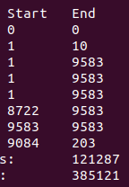

---
tags:
  - Bversity
---

[[[Assignment_6]]]
[[mothur_assi6_1]]
[[mothur_assi6_3]]
[[Mothur]]


```cardlink
url: https://www.youtube.com/watch?v=zWi009rfz84
title: "16s rRNA Sequencing Analysis and Visualization"
description: "Following the data preparation, this video attempt to outline some simple analysis in microbiome analysis and how it can be done simply with a wide varieties..."
host: www.youtube.com
favicon: https://www.youtube.com/s/desktop/375de707/img/favicon_32x32.png
image: https://i.ytimg.com/vi/zWi009rfz84/maxresdefault.jpg
```


## Data 3

| S.No | name | ascession | gender | sample name | host | age | isolation_source | LibraryLayout |
| ---- | ---- | ---- | ---- | ---- | ---- | ---- | ---- | ---- |
| 1 | human gut metagenome Raw sequence reads | SRR26555168 | female | 70670 | Homo sapiens | 52 | Gastric biopsy tissues | PAIRED |
| 2 | "" | SRR26555186 | female | 70616 | Homo sapiens | 58 | "" | PAIRED |
| 3 | "" | SRR26555224 | female | 70147 | Homo sapiens | 60 | "" | Paired |
| 4 | "" | SRR26555260 | male | 70009 | Homo sapiens | 60 | "" | PAIRED |
| 5 | "" | SRR26555274 | male | 50438 | Homo sapiens | 58 | '" | Paired |

Submitted by: National Cancer Center, Korea all three
Design: a population-based case-control study that observed the association between gastric microbiome and the risk of gastric cancer
Study: human gut metagenome Raw sequence reads


---


path to mothur
path to sequence data
/home/frank/Documents/Bioinfromatics/Assignment/assi6/3.mothur/data2

dump all files into a single folder 
(or)

change path for some steps
[for inputdir= ,
fasta=silver.bacteria.fasta, 
(changing the directory of the file silva.bacteria.pcr.fasta after running reference command,.due to some error i encountered),
reference=trainset9_032012.pds.fasta
taxonomy=trainset9_032012.pds.tax


# Coding


```bash
./mothur
```

## Initial process

change in case in different dir
inputdir= (give your path of the folder where your data is kept)

```
make.file(inputdir=mothurhome, type=fastq, prefix=stability)
```


Output File Names: 
/home/frank/Documents/Bioinfromatics/Assignment/assi6/3.mothur/data2/stability.files


`stability.files` should be a file containing the list of sequence file pairs (e.g., forward and reverse reads)
SRR26555168	SRR26555168_1.fastq	SRR26555168_2.fastq	
SRR26555186	SRR26555186_1.fastq	SRR26555186_2.fastq	
SRR26555224	SRR26555224_1.fastq	SRR26555224_2.fastq	
SRR26555260	SRR26555260_1.fastq	SRR26555260_2.fastq	
SRR26555274	SRR26555274_1.fastq	SRR26555274_2.fastq	

-----

## Reducing sequencing and PCR errors

Quality Control for Paired-End Reads:
### step1
The `make.contigs` command in mothur is specifically designed for the assembly of paired-end sequence data into contigs. It takes input files containing pairs of sequences (e.g., forward and reverse reads) and combines them into longer contigs.
```
make.contigs(file=stability.files)
```


......


Group count: 
SRR26555168	112268
SRR26555186	76453
SRR26555224	92430
SRR26555260	56533
SRR26555274	121949

Total of all groups is 459633

It took 396 secs to process 459633 sequences.

Output File Names: 
stability.trim.contigs.fasta
stability.scrap.contigs.fasta
stability.contigs_report
stability.contigs.count_table


```bash
summary.seqs(fasta=stability.trim.contigs.fasta, count=stability.contigs.count_table)
```

		Start	End	NBases	Ambigs	Polymer	NumSeqs
Minimum:	1	297	297	0	3	1
2.5%-tile:	1	313	313	0	4	11491
25%-tile:	1	441	441	0	5	114909
Median: 	1	441	441	0	6	229817
75%-tile:	1	441	441	0	6	344725
97.5%-tile:	1	576	576	9	13	448143
Maximum:	1	602	602	340	301	459633
Mean:	1	435	435	0	6
_  # of unique seqs:	459633
total # of seqs:	459633

It took 12 secs to summarize 459633 sequences.

Output File Names:
stability.trim.contigs.summary

This tells us that we have 459633 sequences that for the most part vary between 297 and 602 bases. Interestingly, the longest read in the dataset is 502 bp. Be suspicious of this.
### step2:
By applying these filtering criteria, `screen.seqs` helps to clean and preprocess sequence data, improving the quality of the dataset before downstream analyses. It's an important step in many bioinformatics workflows, especially in the analysis of amplicon data from high-throughput sequencing technologies.
- `maxambig=0`: Removes sequences with any ambiguous bases.
- `maxlength=602`: Sets the maximum length for sequences.
- `maxhomop=15`: Sets the maximum length of homopolymer runs.
- 

```bash
screen.seqs(fasta=stability.trim.contigs.fasta, count=stability.contigs.count_table, maxambig=0, maxlength=605, maxhomop=15)
```
This implementation of the command will remove any sequences with ambiguous bases and anything longer than 605 bp

It took 5 secs to screen 459633 sequences, removed 74512.

/******************************************/
Running command: remove.seqs(accnos=stability.trim.contigs.bad.accnos.temp, count=stability.contigs.count_table)
Removed 74512 sequences from stability.contigs.count_table.

Output File Names:
stability.contigs.pick.count_table

/******************************************/

Output File Names:
stability.trim.contigs.good.fasta
stability.trim.contigs.bad.accnos
stability.contigs.good.count_table


It took 14 secs to screen 459633 sequences.


To know the situation
```
get.current()
```


to view trimmed file

```
summary.seqs(count=current)
```
output-->

		Start	End	NBases	Ambigs	Polymer	NumSeqs
Minimum:	1	301	301	0	3	1
2.5%-tile:	1	313	313	0	4	9629
25%-tile:	1	441	441	0	5	96281
Median: 	1	441	441	0	5	192561
75%-tile:	1	441	441	0	6	288841
97.5%-tile:	1	514	514	0	11	375493
Maximum:	1	602	602	0	15	385121
Mean:	1	431	431	0	5
_  # of unique seqs:	385121
total # of seqs:	385121

It took 10 secs to summarize 385121 sequences.

Output File Names:
stability.trim.contigs.good.summary


compare before and after


### ==Processing Improved Sequences:==

#### remove duplicates

```bash
unique.seqs(fasta=stability.trim.contigs.good.fasta, count=stability.contigs.good.count_table)
```


Output File Names: 
stability.trim.contigs.good.unique.fasta
stability.trim.contigs.good.count_table


```bash
summary.seqs(count=stability.trim.contigs.good.count_table)
```


Using 4 processors.

		Start	End	NBases	Ambigs	Polymer	NumSeqs
Minimum:	1	301	301	0	3	1
2.5%-tile:	1	313	313	0	4	9629
25%-tile:	1	441	441	0	5	96281
Median: 	1	441	441	0	5	192561
75%-tile:	1	441	441	0	6	288841
97.5%-tile:	1	514	514	0	11	375493
Maximum:	1	602	602	0	15	385121
Mean:	1	431	431	0	5
_  # of unique seqs:	121287
total # of seqs:	385121

It took 3 secs to summarize 385121 sequences.

Output File Names:
stability.trim.contigs.good.unique.summary

compare


### Paired-End Specific Steps:

##### Step1: reference ----

for v4 region of the 16s rrna
```bash
pcr.seqs(fasta=silva.bacteria.fasta, start=13862, end=23444, keepdots=F)
```


rename file
```
rename.file(input=silva.bacteria.pcr.fasta, new=silva.v4.fasta)
```
In case of using different directories changing the directory of the file (silva.bacteria.pcr.fasta) (due to some error)


[NOTE]: no sequences were bad, removing silva.bacteria.bad.accnos

It took 9 secs to screen 14956 sequences.

Output File Names: 
silva.bacteria.pcr.fasta

rename
```bash
rename.file(input=silva.bacteria.pcr.fasta, new=silva.v4.fasta)
```

```bash
summary.seqs(fasta=silva.v4.fasta)
```

		Start	End	NBases	Ambigs	Polymer	NumSeqs
Minimum:	1	8722	230	0	3	1
2.5%-tile:	1	9583	252	0	3	374
25%-tile:	1	9583	253	0	4	3740
Median: 	1	9583	253	0	4	7479
75%-tile:	1	9583	253	0	5	11218
97.5%-tile:	1	9583	254	1	6	14583
Maximum:	9	9583	311	5	9	14956
Mean:	1	9582	252	0	4
 _ # of Seqs:	14956

It took 1 secs to summarize 14956 sequences.

Output File Names:
silva.v4.summary


compare

less numseq because it only contains v4 regions


Now we have a customized reference alignment to align our sequences
##### step2: align----

```bash
align.seqs(fasta=stability.trim.contigs.good.unique.fasta, reference=silva.v4.fasta)
```
output-->fasta=stability.trim.contigs.good.unique.align

It took 168 secs to align 121287 sequences.

[WARNING]: 63074 of your sequences generated alignments that eliminated too many bases, a list is provided in stability.trim.contigs.good.unique.flip.accnos.
[NOTE]: 26996 of your sequences were reversed to produce a better alignment.

It took 168 seconds to align 121287 sequences.

Output File Names: 
stability.trim.contigs.good.unique.align
stability.trim.contigs.good.unique.align_report
stability.trim.contigs.good.unique.flip.accnos


```bash
summary.seqs(fasta=stability.trim.contigs.good.unique.align, count=stability.trim.contigs.good.count_table)
```

		Start	End	NBases	Ambigs	Polymer	NumSeqs
Minimum:	0	0	0	0	1	1
2.5%-tile:	1	10	3	0	1	9629
25%-tile:	1	9583	254	0	4	96281
Median: 	1	9583	254	0	4	192561
75%-tile:	1	9583	254	0	4	288841
97.5%-tile:	8722	9583	254	0	5	375493
Maximum:	9583	9583	310	0	15	385121
Mean:	1352	9084	203	0	3
__ # of unique seqs:	121287
total # of seqs:	385121

It took 14 secs to summarize 385121 sequences.

Output File Names:
stability.trim.contigs.good.unique.summary

compare


##### step3: standardize the data (start and end )
The decision of what values to use for the `start` and `end` parameters in `screen.seqs` depends on your specific analysis goals and the characteristics of your dataset.
based on above output
1. **Region of Interest:**
    
    - If you are interested in a specific region of your sequences (e.g., a particular gene or functional domain), choose the start and end positions that correspond to that region.
2. **Conserved Regions:**
    
    - If you want to focus on conserved regions, consider the regions where most sequences overlap. Looking at the percentiles (e.g., 25%-tile, 75%-tile), you might choose a range where the majority of sequences align.
3. **Avoid Variable Regions:**
    
    - If there are variable or ambiguous regions, you might want to exclude them by setting `start` and `end` accordingly.
4. **Alignment Quality:**
    
    - Consider the quality of the alignment. If certain positions have poor alignment quality, you might want to exclude them.
This example uses the 25%-tile values for `start` and `end`. However, you should adjust these values based on your specific goals and the characteristics of your dataset.


start = 1
end = 9583
```
screen.seqs(fasta=stability.trim.contigs.good.unique.align, count=stability.trim.contigs.good.count_table, start=1, end=9583)

```


```bash
summary.seqs(fasta=current, count=current)
```

		Start	End	NBases	Ambigs	Polymer	NumSeqs
Minimum:	1	9583	241	0	3	1
2.5%-tile:	1	9583	253	0	4	7617
25%-tile:	1	9583	254	0	4	76162
Median: 	1	9583	254	0	4	152323
75%-tile:	1	9583	254	0	4	228484
97.5%-tile:	1	9583	254	0	4	297028
Maximum:	1	9583	310	0	14	304644
Mean:	1	9583	253	0	4
_ # of unique seqs:	58481
total # of seqs:	304644

It took 6 secs to summarize 304644 sequences.

Output File Names:
stability.trim.contigs.good.unique.good.summary


compare


### Sequence Preprocessing:


#### Step1: filter/remove overhang and gap characters (i.e. “-“)----

```bash
filter.seqs(fasta=stability.trim.contigs.good.unique.good.align, vertical=T, trump=.)
```

Length of filtered alignment: 527
Number of columns removed: 9056
Length of the original alignment: 9583
Number of sequences used to construct filter: 58481

Output File Names: 
stability.filter
stability.trim.contigs.good.unique.good.filter.fasta


#### Step2: rerun unique.seqs ----(remove duplicates)
Re-running `unique.seqs` after trimming helps to identify and remove these duplicated or nearly identical sequences.
```bash
unique.seqs(fasta=stability.trim.contigs.good.unique.good.filter.fasta, count=stability.trim.contigs.good.good.count_table)
```

Output File Names: 
stability.trim.contigs.good.unique.good.filter.unique.fasta
stability.trim.contigs.good.unique.good.filter.count_table


#### Step3: Further denoise
The `diffs` parameter controls the number of differences allowed between sequences for them to be considered the same. In your case, it's set to 2. allowing 3 difference for every 100 bp of sequence.
```bash
pre.cluster(fasta=stability.trim.contigs.good.unique.good.filter.unique.fasta, count=stability.trim.contigs.good.unique.good.filter.count_table, diffs=2)
```


Selected 2794 sequences from SRR26555224.
Selected 3104 sequences from SRR26555186.
Selected 4506 sequences from SRR26555168.
Selected 2237 sequences from SRR26555260.
Selected 4092 sequences from SRR26555274.


It took 0 secs to merge 6462 sequences group data.
/******************************************/
Running get.seqs: 
Selected 6238 sequences from stability.trim.contigs.good.unique.good.filter.unique.fasta.
/******************************************/
It took 2 secs to run pre.cluster.

Using 4 processors.

Output File Names: 
stability.trim.contigs.good.unique.good.filter.unique.precluster.fasta
stability.trim.contigs.good.unique.good.filter.unique.precluster.count_table
stability.trim.contigs.good.unique.good.filter.unique.precluster.SRR26555168.map
stability.trim.contigs.good.unique.good.filter.unique.precluster.SRR26555186.map
stability.trim.contigs.good.unique.good.filter.unique.precluster.SRR26555224.map
stability.trim.contigs.good.unique.good.filter.unique.precluster.SRR26555260.map
stability.trim.contigs.good.unique.good.filter.unique.precluster.SRR26555274.map


#### Step:4 Removing chimeras
usng VSEARCH algorithm
When running `mothur`’s chimera commands, `mothur` will automatically remove the chimeras from your fasta and count files
```bash
chimera.vsearch(fasta=stability.trim.contigs.good.unique.good.filter.unique.precluster.fasta, count=stability.trim.contigs.good.unique.good.filter.unique.precluster.count_table, dereplicate=t)
```
output-->


#### step1-4 visualize
```bash
summary.seqs(fasta=current, count=current)
```


compare


----


### ==Taxonomy Assignment:==

#### step1: classify
changes to file path
reference=trainset9_032012.pds.fasta
taxonomy=trainset9_032012.pds.tax
```bash
classify.seqs(fasta=stability.trim.contigs.good.unique.good.filter.unique.precluster.denovo.vsearch.fasta, count=stability.trim.contigs.good.unique.good.filter.unique.precluster.denovo.vsearch.count_table, reference=trainset9_032012.pds.fasta, taxonomy=trainset9_032012.pds.tax)
```


Output File Names: 
stability.trim.contigs.good.unique.good.filter.unique.precluster.denovo.vsearch.pds.wang.taxonomy
stability.trim.contigs.good.unique.good.filter.unique.precluster.denovo.vsearch.pds.wang.tax.summary
stability.trim.contigs.good.unique.good.filter.unique.precluster.denovo.vsearch.pds.wang.flip.accnos


#### step2: remove undesirable
Now that everything is classified we want to remove our undesirables

```bash
remove.lineage(fasta=stability.trim.contigs.good.unique.good.filter.unique.precluster.denovo.vsearch.fasta, count=stability.trim.contigs.good.unique.good.filter.unique.precluster.denovo.vsearch.count_table, taxonomy=stability.trim.contigs.good.unique.good.filter.unique.precluster.denovo.vsearch.pds.wang.taxonomy, taxon=Chloroplast-Mitochondria-unknown-Archaea-Eukaryota)
```


Output File Names:
stability.trim.contigs.good.unique.good.filter.unique.precluster.denovo.vsearch.pick.fasta
stability.trim.contigs.good.unique.good.filter.unique.precluster.denovo.vsearch.pick.count_table

/******************************************/

Output File Names:
stability.trim.contigs.good.unique.good.filter.unique.precluster.denovo.vsearch.pds.wang.pick.taxonomy
stability.trim.contigs.good.unique.good.filter.unique.precluster.denovo.vsearch.pds.wang.accnos
stability.trim.contigs.good.unique.good.filter.unique.precluster.denovo.vsearch.pick.count_table
stability.trim.contigs.good.unique.good.filter.unique.precluster.denovo.vsearch.pick.fasta


Now, to create an updated taxonomy summary file that reflects these removals we use the [summary.tax](https://mothur.org/wiki/summary.tax) command: This creates a pick.tax.summary file with the undesirables removed.
```bash
summary.tax(taxonomy=current, count=current)
```

Output File Names: 
stability.trim.contigs.good.unique.good.filter.unique.precluster.denovo.vsearch.pds.wang.pick.tax.summary


## Cluster the sequences into OTUs
//error calculation if Mock data is available
 ~~At this point we have curated our data as far as possible and we’re ready to see what our error rate is~~//


1. **Calculate Distances:**
```bash
dist.seqs(fasta=stability.trim.contigs.good.unique.good.filter.unique.precluster.denovo.vsearch.pick.fasta, cutoff=0.03)
```

It took 59 secs to find distances for 6119 sequences. 2173871 distances below cutoff 0.03.
Output File Names: 
stability.trim.contigs.good.unique.good.filter.unique.precluster.denovo.vsearch.pick.dist

2. **Cluster Sequences into OTUs:**
```bash
cluster(column=stability.trim.contigs.good.unique.good.filter.unique.precluster.denovo.vsearch.pick.dist, count=stability.trim.contigs.good.unique.good.filter.unique.precluster.denovo.vsearch.pick.count_table)
```

Output File Names: 
stability.trim.contigs.good.unique.good.filter.unique.precluster.denovo.vsearch.pick.opti_mcc.list
stability.trim.contigs.good.unique.good.filter.unique.precluster.denovo.vsearch.pick.opti_mcc.steps
stability.trim.contigs.good.unique.good.filter.unique.precluster.denovo.vsearch.pick.opti_mcc.sensspec


3. **Create Shared File for OTUs:**
```bash
make.shared(list=stability.trim.contigs.good.unique.good.filter.unique.precluster.denovo.vsearch.pick.opti_mcc.list, count=stability.trim.contigs.good.unique.good.filter.unique.precluster.denovo.vsearch.pick.count_table, label=0.03)
```

Output File Names:
stability.trim.contigs.good.unique.good.filter.unique.precluster.denovo.vsearch.pick.opti_mcc.shared


4. **Perform Rarefaction Analysis:**
```bash
rarefaction.single(shared=stability.trim.contigs.good.unique.good.filter.unique.precluster.denovo.vsearch.pick.opti_mcc.shared)`
```

Output File Names: 
stability.trim.contigs.good.unique.good.filter.unique.precluster.denovo.vsearch.pick.opti_mcc.groups.rarefaction


---

## ==Preparing for analysis==
rename the files for convenience 

```bash
rename.file(fasta=current, count=current, taxonomy=current, prefix=final)
```

Current files saved by mothur:
accnos=stability.trim.contigs.good.unique.good.filter.unique.precluster.denovo.vsearch.pds.wang.accnos
column=stability.trim.contigs.good.unique.good.filter.unique.precluster.denovo.vsearch.pick.dist
fasta=final.fasta
list=stability.trim.contigs.good.unique.good.filter.unique.precluster.denovo.vsearch.pick.opti_mcc.list
shared=stability.trim.contigs.good.unique.good.filter.unique.precluster.denovo.vsearch.pick.opti_mcc.shared
taxonomy=final.taxonomy
contigsreport=stability.contigs_report
count=final.count_table
processors=4
summary=stability.trim.contigs.good.unique.good.filter.unique.precluster.denovo.vsearch.summary
file=/home/frank/Documents/Bioinfromatics/Assignment/assi6/3.mothur/data2/stability.files

also 
```bash
count.seq(count=final.conut_table, compress=f)
```

output file
final.full.count_table


#### OTUs
Now we have a couple of options for clustering sequences into OTUs. For a small dataset like this, we can do the traditional approach using [dist.seqs](https://mothur.org/wiki/dist.seqs) and [cluster](https://mothur.org/wiki/cluster):
operational taxonomic units (OTUs). OTU (operational taxonomicUNit (OTU) is an operational defination used to classify groups of closely related individuals.


```bash
dist.seqs(fasta=final.fasta, cutoff=0.03)
```

It took 67 secs to find distances for 6119 sequences. 2173871 distances below cutoff 0.03.
Output File Names: 
final.dist


```bash
cluster(column=final.dist, count=final.count_table)
```

It took 26 seconds to cluster

Output File Names: 
final.opti_mcc.list
final.opti_mcc.steps
final.opti_mcc.sensspec


```
make.shared(list=final.opti_mcc.list, count=final.count_table, label=0.03)
```

Output File Names:
final.opti_mcc.shared


Taxaonmy
We probably also want to know the taxonomy for each of our OTUs. We can get the consensus taxonomy for each OTU using the [classify.otu](https://mothur.org/wiki/classify.otu) command:

```bash
classify.otu(list=final.opti_mcc.list, count=final.count_table, taxonomy=final.taxonomy, label=0.03)
```

Output File Names: 
final.opti_mcc.0.03.cons.taxonomy
final.opti_mcc.0.03.cons.tax.summary


### Phylotypes

For some analyses you may desire to bin your sequences in to phylotypes according to their taxonomic classification. We can do this using the [phylotype](https://mothur.org/wiki/phylotype) command:

In microbiology, a phylotype is **a DNA sequence or group of sequences sharing more than an arbitrarily chosen level of similarity of a particular gene marker**.

```bash
phylotype(taxonomy=final.taxonomy)
```

Output File Names: 
final.tx.sabund
final.tx.rabund
final.tx.list

```
make.shared(list=final.tx.list, count=final.count_table, label=1)
```

Output File Names:
final.tx.shared

We also want to know who these OTUs are and can run [classify.otu](https://mothur.org/wiki/classify.otu) on our phylotypes:

```
classify.otu(list=final.tx.list, count=final.count_table, taxonomy=final.taxonomy, label=1)
```

final.tx.1.cons.taxonomy
final.tx.1.cons.tax.summary
final.tx.2.cons.taxonomy
final.tx.2.cons.tax.summary
final.tx.3.cons.taxonomy
final.tx.3.cons.tax.summary
final.tx.4.cons.taxonomy
final.tx.4.cons.tax.summary
final.tx.5.cons.taxonomy
final.tx.5.cons.tax.summary
final.tx.6.cons.taxonomy
final.tx.6.cons.tax.summary


### Phylogenetic


```
dist.seqs(fasta=final.fasta, output=lt)
```

It took 86 secs to find distances for 6119 sequences. 18718021 distances below cutoff 1.
Output File Names: 
final.phylip.dist


```
clearcut(phylip=final.phylip.dist)
```

Output File Names:
final.phylip.tre


## Analysis

We now want to do is see how many sequences we have in each sample. We’ll do this with the [count.groups](https://mothur.org/wiki/count.groups) command:
```
count.groups(shared=final.opti_mcc.shared)
```

SRR26555168 contains 68914.
SRR26555186 contains 59299.
SRR26555224 contains 53531.
SRR26555260 contains 24450.
SRR26555274 contains 97975.

Size of smallest group: 24450.

Total seqs: 304169.

Output File Names: 
final.opti_mcc.count.summary


We see that our smallest sample had 24450 ↖sequences in it.
chages
subset (size= ⤴)
```bash
sub.sample(shared=final.opti_mcc.shared, size=24450)
```

0.03 
Sampling 24450 from each group.

Output File Names: 
final.opti_mcc.0.03.subsample.shared


## OTU-based analysis

#### Alpha diversity

Let’s start our analysis by analyzing the alpha diversity of the samples. First we will generate rarefaction curves describing the number of OTUs observed as a function of sampling effort. We’ll do this with the [rarefaction.single](https://mothur.org/wiki/rarefaction.single) command:
OTU (operational taxonomicUNit (OTU) is an operational defination used to classify groups of closely related individuals.


ideal --> blue line


```bash
rarefaction.single(shared=final.opti_mcc.shared, calc=sobs, freq=100)
```

Output File Names: 
final.opti_mcc.groups.rarefaction

```bash
summary.single(shared=final.opti_mcc.shared, calc=nseqs-coverage-sobs-invsimpson, subsample=T)
```


Output File Names: 
final.opti_mcc.groups.ave-std.summary


#### Beta diversity measurements

```bash
dist.shared(shared=final.opti_mcc.shared, calc=braycurtis-jclass, subsample=t)
```

It took 5 seconds to run dist.shared.

Output File Names: 
final.opti_mcc.braycurtis.0.03.lt.ave.dist
final.opti_mcc.braycurtis.0.03.lt.std.dist
final.opti_mcc.jclass.0.03.lt.ave.dist
final.opti_mcc.jclass.0.03.lt.std.dist

**Run PCoA:**

change
```
pcoa(phylip=final.opti_mcc.braycurtis.0.03.lt.ave.dist)
```

Processing...
Rsq 1 axis: 0.97215
Rsq 2 axis: 0.993517
Rsq 3 axis: 0.997549

Output File Names: 
final.opti_mcc.braycurtis.0.03.lt.ave.pcoa.axes
final.opti_mcc.braycurtis.0.03.lt.ave.pcoa.loadings

//skip
```bash
nmds(phylip=final.opti_mcc.braycurtis.0.03.lt.ave.dist)
```

```bash
nmds(phylip=final.opti_mcc.braycurtis.0.03.lt.ave.dist, mindim=3, maxdim=3)
```

skip//
## amova


Making metadata file --> text editor --> tab seperation --> save as metadata_mothur.design

first column should be 'group' header

group	gender	age
SRR26555268	female	52
SRR26555186	female	58
SRR26555224	female	60
SRR26555260	male	60
SRR26555274	male	58

```bash
amova(phylip=final.opti_mcc.braycurtis.0.03.lt.ave.dist, design=metadata_mothur.design)
```

female-male	Among	Within	Total
SS	0.0028179	0.0115313	0.0143492
df	1	3	4
MS	0.0028179	0.00384378

Fs:	0.733108
p-value: 0.598

Experiment-wise error rate: 0.05
If you have borderline P-values, you should try increasing the number of iterations

Output File Names: 
final.opti_mcc.braycurtis.0.03.lt.ave.amova


## homova

```bash
homova(phylip=final.opti_mcc.braycurtis.0.03.lt.ave.dist, design=metadata_mothur.design)
```

HOMOVA	BValue	P-value	SSwithin/(Ni-1)_values
female-male	1.10099	0.299	0.00115533	0.00922068
Experiment-wise error rate: 0.05
If you have borderline P-values, you should try increasing the number of iterations

Output File Names: 
final.opti_mcc.braycurtis.0.03.lt.ave.homova

## corr.axes

```
corr.axes(axes=final.opti_mcc.braycurtis.0.03.lt.ave.pcoa.axes, shared=final.opti_mcc.0.03.subsample.shared, method=spearman, numaxes=3)
```

You did not provide a label, I will use the first label in your inputfile.

Output File Names: 
final.opti_mcc.0.03.subsample.spearman.corr.axes
metadata_age_mothur.metadata
```
corr.axes(axes=final.opti_mcc.braycurtis.0.03.lt.ave.pcoa.axes, metadata=metadata_age_mothur.metadata, method=spearman, numaxes=3)
```

Output File Names: 
metadata_age_mothur.spearman.corr.axes

```
get.communitytype(shared=final.opti_mcc.0.03.subsample.shared)
```

[NOTE]: This command is designed to be run with datasets containing > 50 samples.

[WARNING]: You have not provided enough valid groups, for maxpartitions=10. Reducing maxpartitions to 5.


K	NLE		logDet	BIC		AIC		Laplace

1	10400.65	311.32	11535.30	11810.65	9260.60
2	13696.94	-2662.93	15967.06	16517.94	9773.16
3	17149.08	-5728.56	20554.65	21381.08	10395.86
4	20946.30	-8925.10	25487.33	26589.30	11298.18
5	24620.60	-12014.92	30297.08	31674.60	12130.95

Output File Names: 
final.opti_mcc.0.03.subsample.0.03.dmm.mix.fit
final.opti_mcc.0.03.subsample.0.03.dmm.1.mix.posterior
final.opti_mcc.0.03.subsample.0.03.dmm.1.mix.relabund
final.opti_mcc.0.03.subsample.0.03.dmm.2.mix.posterior
final.opti_mcc.0.03.subsample.0.03.dmm.2.mix.relabund
final.opti_mcc.0.03.subsample.0.03.dmm.3.mix.posterior
final.opti_mcc.0.03.subsample.0.03.dmm.3.mix.relabund
final.opti_mcc.0.03.subsample.0.03.dmm.4.mix.posterior
final.opti_mcc.0.03.subsample.0.03.dmm.4.mix.relabund
final.opti_mcc.0.03.subsample.0.03.dmm.5.mix.posterior
final.opti_mcc.0.03.subsample.0.03.dmm.5.mix.relabund
final.opti_mcc.0.03.subsample.0.03.dmm.mix.design
final.opti_mcc.0.03.subsample.0.03.dmm.mix.parameters
final.opti_mcc.0.03.subsample.0.03.dmm.mix.summary


## Population-level analysis

metadata_mothur.design
```
metastats(shared=final.opti_mcc.0.03.subsample.shared, design=metadata_mothur.design)
```

0.03 

Comparing male and female...


Output File Names: 
final.opti_mcc.0.03.subsample.0.03.male_female.metastats

```
lefse(shared=final.opti_mcc.0.03.subsample.shared, design=metadata_mothur.design)
```


Output File Names: 
final.opti_mcc.0.03.subsample.0.03.lefse_summary


#### Alpha diversity
```
phylo.diversity(tree=final.phylip.tre, count=final.count_table, rarefy=T)
```

This will generate a file ending in rarefaction.

It took 78 secs to run phylo.diversity.

Output File Names: 
final.phylip.1.phylodiv.summary
final.phylip.1.phylodiv.rarefaction

#### Beta diversity

```
unifrac.unweighted(tree=final.phylip.tre, count=final.count_table, distance=lt,random=F, subsample=t)
```

It took 278 secs to run the subsampling.
1	SRR26555168-SRR26555186	0.890911
1	SRR26555168-SRR26555224	0.900106
1	SRR26555186-SRR26555224	0.902999
1	SRR26555168-SRR26555260	0.895717
1	SRR26555186-SRR26555260	0.906033
1	SRR26555224-SRR26555260	0.899983
1	SRR26555168-SRR26555274	0.926559
1	SRR26555186-SRR26555274	0.922701
1	SRR26555224-SRR26555274	0.935641
1	SRR26555260-SRR26555274	0.931528
It took 278 secs to run unifrac.unweighted.


Output File Names: 
final.phylip.uwsummary
final.phylip.1.unweighted.ave.dist
final.phylip.1.unweighted.std.dist
final.phylip.tre1.unweighted.phylip.dist

```
unifrac.weighted(tree=final.phylip.tre, count=final.count_table, distance=lt, random=F, subsample=t)
```
These commands will distance matrices (final.phylip.1.weighted.ave.dist) that can be analyzed using all of the beta diversity approaches described above for the OTU-based analyses.

Setting subsample size to 24450.

Tree#	Groups	WScore	
1	SRR26555168-SRR26555186	0.483641
1	SRR26555168-SRR26555224	0.558322
1	SRR26555186-SRR26555224	0.290974
1	SRR26555168-SRR26555260	0.456173
1	SRR26555186-SRR26555260	0.67486
1	SRR26555224-SRR26555260	0.727261
1	SRR26555168-SRR26555274	0.935038
1	SRR26555186-SRR26555274	0.859121
1	SRR26555224-SRR26555274	0.837552
1	SRR26555260-SRR26555274	0.96385
100
200
300
400
500
600
700
800
900
1000
It took 300 secs to run unifrac.weighted.

Output File Names: 
final.phylip.tre1.weighted.phylip.dist
final.phylip.tre1.wsummary
final.phylip.tre1.weighted.ave.dist
final.phylip.tre1.weighted.std.dist


-----------------


rerun-------------------------------------------------


## To export sample phylo Tree

```bash
cluster.split(fasta=final.fasta, count=final.count_table, taxonomy=final.taxonomy, cutoff=0.03)
```

NOTE: sens.spec assumes that only unique sequences were used to generate the distance matrix.

label	cutoff	numotus	tp	tn	fp	fn	sensitivity	specificity	ppv	npv	fdr	accuracy	mcc	f1score
0.03
0.03	0.03	2947	2.00882e+06	1.6328e+07	216207	165047	0.924077	0.986932	0.902829	0.989993	0.902829	0.979632	0.901869	0.913329

It took 13 to run sens.spec.

Output File Names: 
final.opti_mcc.sensspec

/******************************************/
Done.


label	cutoff	numotus	tp	tn	fp	fn	sensitivity	specificity	ppv	npv	fdr	accuracy	mcc	f1score
0.03	0.03	2947	2.00882e+06	1.6328e+07	216207	165047	0.9241	0.9869	0.9028	0.99	0.9028	0.9796	0.9019	0.9133

Output File Names: 
final.dist
final.opti_mcc.list
final.opti_mcc.sensspec

```bash
make.shared(list=final.opti_mcc.list, count=final.count_table)
```

Output File Names:
final.opti_mcc.shared


```bash
tree.shared(shared=final.opti_mcc.shared)
```

1
1

Output File Names: 
final.opti_mcc.jclass.0.03.tre
final.opti_mcc.thetayc.0.03.tre


