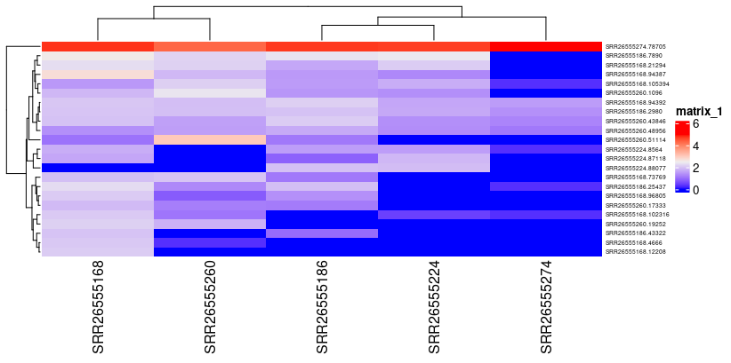
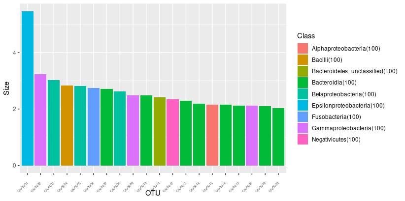
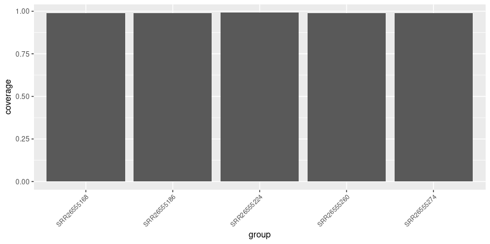
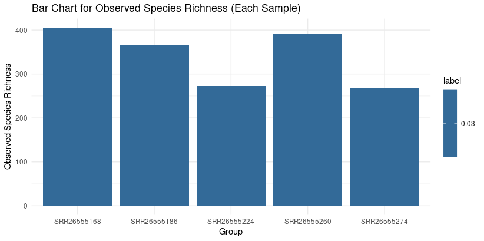
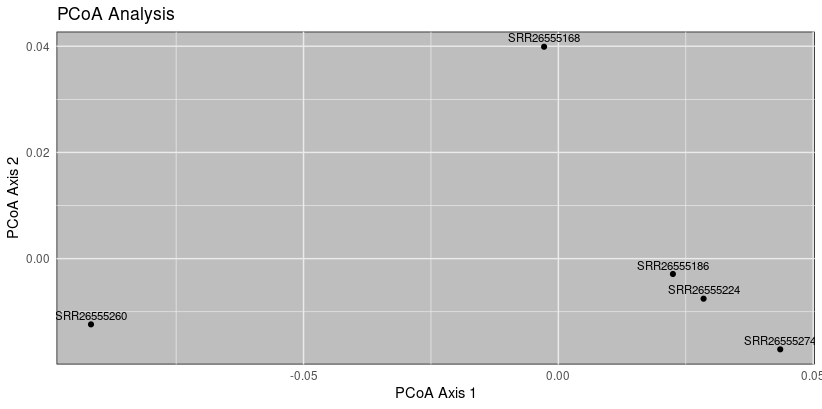
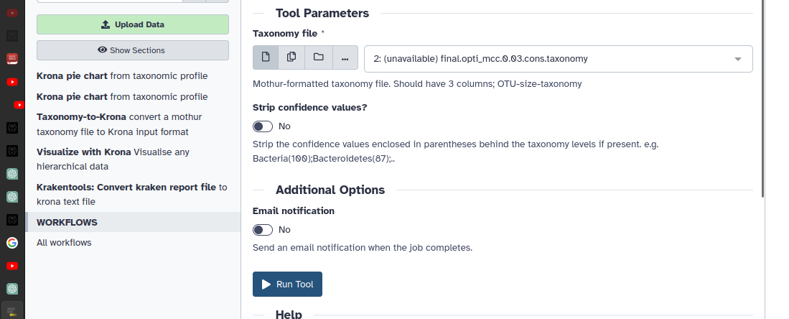
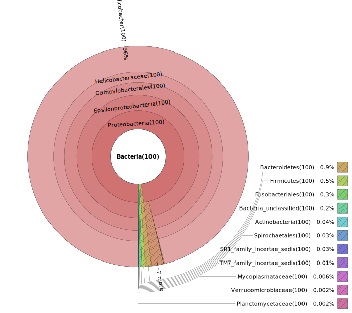
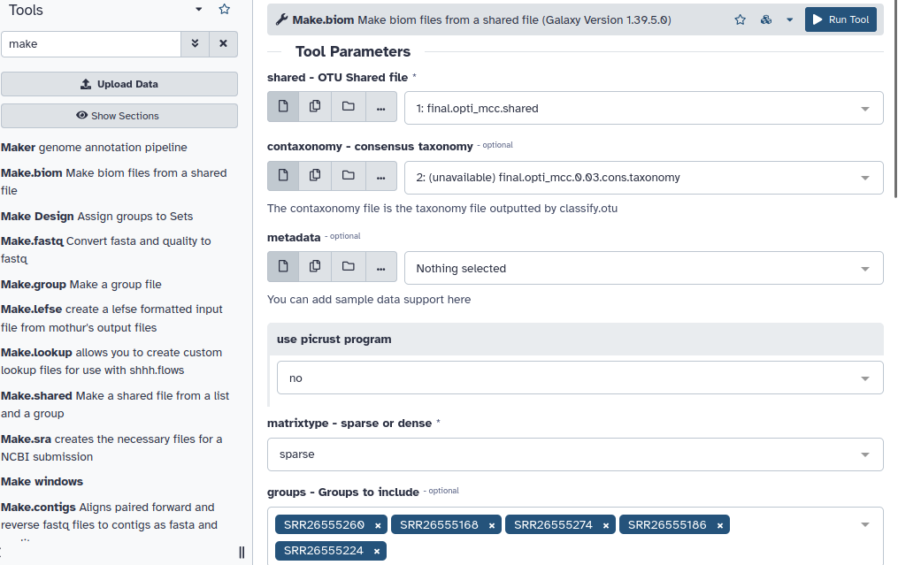

This visualization is for [[Assignment_6]], experiment run process in [[mothur_assi6_4]]  .
Now visualizing the results in several programs.


Visualization softwares used
- R program
- Galaxy server online
- Megan 6 


----

Required files from mothur-processed data files

R1-->Taxanomy heatmap
	final.count_table
	final.taxonomy

R2--> Taxanomy bar plot (also galaxy)
	final.opti_mcc.0.03.cons.taxonomy

R3--> Alpha Diversity (rarfraction analysis)
	final.opti_mcc.braycurtis.0.03.lt.ave.pcoa.axes

R4--> Beta Diversity (pcoa plot)
	final.opti_mcc.groups.ave-std.summary

R5 (or) Megax (or) figtree--> Phylogenetic tree
	final.opti_mcc.jclass.0.03.tre
	final.opti_mcc.thetayc.0.03.tre
	
	final.phylip.tre


Galaxy--> Taxanomy  (also R2)
final.opti_mcc.shared
final.opti_mcc.0.03.cons.taxonomy


Megan6--> Taxanomy and many
biome file from galaxy


	amova and hmova analysis in  mothur


---
## R1-->Taxanomy heatmap
	final.count_table
	final.taxonomy

```cardlink
url: https://www.youtube.com/watch?v=zWi009rfz84
title: "16s rRNA Sequencing Analysis and Visualization"
description: "Following the data preparation, this video attempt to outline some simple analysis in microbiome analysis and how it can be done simply with a wide varieties..."
host: www.youtube.com
favicon: https://www.youtube.com/s/desktop/375de707/img/favicon_32x32.png
image: https://i.ytimg.com/vi/zWi009rfz84/maxresdefault.jpg
```


```R
install.packages('readr')
library(tidyr)
library(readr)

count <- read_delim("final.full.count_table", 
                    delim = "\t", escape_double = FALSE, 
                    trim_ws = TRUE)

contig <- read_delim("final.taxonomy", delim = "\t", 
                     escape_double = FALSE, col_names = FALSE, 
                     trim_ws = TRUE)

contig_tax <- contig %>% separate(2,sep = ";",into= c("Kingdom","Phylum","Class","Order","Family","Genus","Species"))
contig_tax <- contig_tax[,-8]
head(contig_tax)  
##########################################################################
library(ggplot2)
library(ComplexHeatmap)

count_high <- count[count$total >100,]
count_high2 <- count_high[,-c(1,2)]
count_high2 <- log10(count_high2+1)
count_high2  <- as.matrix(count_high2,ncol=19)
rownames(count_high2) <- count$Representative_Sequence[1:100]

Heatmap(count_high2, row_names_gp = gpar(fontsize = 5))

```
😢
modified due to some errors
```R
## Analysis
#install.packages('readr')
#BiocManager::install("ComplexHeatmap")

library(tidyr)
library(readr)

# Read data
count <- read_delim("final.full.count_table", delim = "\t", escape_double = FALSE, trim_ws = TRUE)
contig <- read_delim("final.taxonomy", delim = "\t", escape_double = FALSE, col_names = FALSE, trim_ws = TRUE)

# Separate taxonomy columns
contig_tax <- contig %>% separate(2, sep = ";", into = c("Kingdom", "Phylum", "Class", "Order", "Family", "Genus", "Species"))
contig_tax <- contig_tax[, -8]

# Head of contig_tax
head(contig_tax)

#######################################################################################
library(ggplot2)
library(ComplexHeatmap)

# Filter count data
count_high <- count[count$total > 100, ]
count_high2 <- log10(count_high[, -c(1, 2)] + 1)
count_high2 <- as.matrix(count_high2)
rownames(count_high2) <- count_high$Representative_Sequence

# Plot heatmap using ComplexHeatmap
Heatmap(count_high2, row_names_gp = gpar(fontsize = 5))
########################################################

```
😄


Thank you for providing additional information. It seems that the number of entries in `count_high2` after filtering is 23, and it has 5 columns. The original `count` dataframe has 6,119 entries and 7 columns. The discrepancy in the number of entries might be due to the filtering condition.

To address this, you can modify the code to ensure that the filtering condition is appropriate for your dataset. If you want to retain all entries in `count` that have a total greater than 100, you can adjust the filtering condition as follows:

R

`count_high <- count[count$total > 100, ] count_high2 <- log10(count_high[, -c(1, 2)] + 1) count_high2 <- as.matrix(count_high2) rownames(count_high2) <- count_high$Representative_Sequence`

This code filters the rows in `count` based on the condition `total > 100` and retains all entries that satisfy this condition. Then, it performs the log transformation and assigns row names to the resulting matrix using the `Representative_Sequence` column from the filtered `count_high` dataframe.




Explination:

----

## R2--> Taxanomy bar plot (also galaxy)
	final.opti_mcc.0.03.cons.taxonomy

```R
##########################################################################

## R2--> Taxanomy bar plot 
OTU <- read.delim("final.opti_mcc.0.03.cons.taxonomy")
OTU_tax <- OTU %>% separate(3,sep = ";",into= c("Kingdom","Phylum","Class","Order","Family","Genus","Species"))
OTU_tax <- OTU_tax[,-9]

OTU_tax_high <- OTU_tax[OTU_tax$Size>100,]

OTU_tax_high$Size <- log10(OTU_tax_high$Size+1)

ggplot(data = OTU_tax_high, aes(x = OTU,y=Size, fill=Class)) + 
  geom_bar(aes(), stat="identity", position="stack") +
  theme(axis.text.x = element_text(angle=45, vjust=.5, hjust=1,size = 5))

```

Results:



---
## R3--> Alpha Diversity (rarfraction analysis)
	final.opti_mcc.braycurtis.0.03.lt.ave.pcoa.axes
	







----

## R4--> Beta Diversity (pcoa plot)
	final.opti_mcc.groups.ave-std.summary



The beta diversity PCoA plot provides insights into the dissimilarity patterns between samples based on the calculated principal coordinates. Here is an analysis of the plot:

1. **SRR26555168:**
    
    - Positioned slightly towards positive values on Axis 2 and Axis 4.
    - Indicates a moderate dissimilarity compared to other samples.
2. **SRR26555186:**
    
    - Positioned on the positive side of Axis 1 and slightly on the negative side of Axis 3.
    - Shows dissimilarity, particularly along Axis 1, compared to other samples.
3. **SRR26555224:**
    
    - Positioned on the positive side of Axis 1 and slightly on the negative side of Axis 3.
    - Suggests dissimilarity, especially along Axis 1.
4. **SRR26555260:**
    
    - Positioned significantly towards negative values on Axis 1 and Axis 2.
    - Indicates a distinct dissimilarity compared to other samples, particularly along Axis 1 and Axis 2.
5. **SRR26555274:**
    
    - Positioned on the positive side of Axis 1 and Axis 2.
    - Shows dissimilarity, particularly along Axis 1 and Axis 2, compared to other samples.

**Overall Interpretation:**

- The PCoA plot suggests varying levels of dissimilarity among the samples.
- Samples SRR26555260 appear to be distinct from others, showing a unique microbial composition.
- Axes 1 and 2 seem to contribute significantly to the observed dissimilarity patterns.
- 
----

## R5 (or) Megax (or) figtree--> Phylogenetic tree
	final.opti_mcc.jclass.0.03.tre
	final.opti_mcc.thetayc.0.03.tre
	
	final.phylip.tre

In figtree
jclass tree ?


----
## Galaxy--> Taxanomy  (also R2)
final.opti_mcc.shared
final.opti_mcc.0.03.cons.taxonomy







