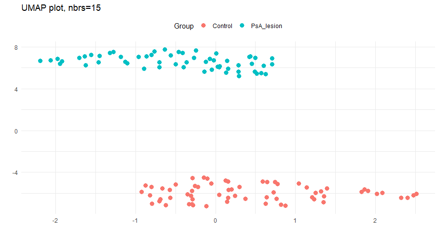
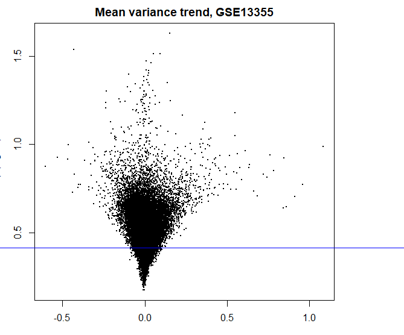

# Visualization
#### Visualize and quality control test results.
Build histogram of P-values for all genes. Normal test
assumption is that most genes are not differentially expressed.

1. **Extracting all Significant Genes:**
   ```R
   tT2 <- topTable(fit2, adjust="fdr", sort.by="B", number=Inf)
   ```
   This line generates a table (`tT2`) containing all significant genes based on the adjusted p-values (`adj.P.Val`) using the False Discovery Rate (FDR) correction. The results are sorted by the absolute value of the B-statistic (`B`). Setting `number=Inf` ensures that all significant genes are included in the table.

2. **Creating a Histogram of Adjusted P-values:**
   ```R
   hist(tT2$adj.P.Val, col = "grey", border = "white", xlab = "P-adj",
        ylab = "Number of genes", main = "P-adj value distribution")
   ```
   This code generates a histogram of the adjusted p-values (`adj.P.Val`) from the `tT2` table. The histogram is displayed with grey bars and a white border. The x-axis label is set to "P-adj", the y-axis label is set to "Number of genes", and the main title of the plot is "P-adj value distribution".

The histogram provides a visual representation of the distribution of adjusted p-values, which is a critical aspect of understanding the significance of genes in the dataset. This plot can help identify any patterns or thresholds in the distribution of p-values, aiding in the interpretation of the analysis results.


----

```R
# summarize test results as "up", "down" or "not expressed"
dT <- decideTests(fit2, adjust.method="fdr", p.value=0.05, lfc=0)
```
The `decideTests()` function is typically used to summarize the results of differential expression analysis by categorizing genes as "upregulated", "downregulated", or "not differentially expressed" based on certain thresholds.

- `fit2`: This is the fitted linear model object obtained from the linear modeling process (e.g., using `lmFit()` and `eBayes()`).
- `adjust.method="fdr"`: This parameter specifies the method used to adjust p-values for multiple testing. In this case, the False Discovery Rate (FDR) method is used.
- `p.value=0.05`: This parameter sets the threshold for adjusted p-values. Genes with adjusted p-values less than 0.05 are considered statistically significant.
- `lfc=0`: This parameter sets the threshold for the absolute value of the log-fold change (LFC). Genes with absolute LFC greater than 0 are considered differentially expressed.

The `decideTests()` function assigns labels to each gene indicating whether it is upregulated, downregulated, or not differentially expressed based on the specified criteria.

- Genes with adjusted p-values less than 0.05 and absolute LFC greater than 0 are labeled as "up" if they are upregulated, "down" if they are downregulated, or "not expressed" if they do not meet the criteria for differential expression.

The `dT` object will contain information about the test results for each gene in the dataset, allowing further analysis and interpretation of the differential expression results.

---
#### Venn diagram
```R
vennDiagram(dT, circle.col=palette())
```
The `vennDiagram()` function in R is typically used to create Venn diagrams to visualize the intersection and relationships between multiple sets of data.


----

### box-and-whisker plot

```R
#6
# box-and-whisker plot
#dev.new(width=3+ncol(gset)/6, height=5)
ord <- order(gs)  # order samples by group
palette(c("#1B9E77", "#7570B3", "#E7298A", "#E6AB02", "#D95F02",
          "#66A61E", "#A6761D", "#B32424", "#B324B3", "#666666"))
par(mar=c(7,4,2,1))
title <- paste ("GSE13355,selected samples")
boxplot(ex[,ord], boxwex=0.6, notch=T, main=title, outline=FALSE, las=2, col=gs[ord])
legend("topleft", groups, fill=palette(), bty="n")
#dev.off()
```


#### Q-Q plot for t-statistic
```R
t.good <- which(!is.na(fit2$F)) # filter out bad probes
qqt(fit2$t[t.good], fit2$df.total[t.good], main="Moderated t statistic")
```
The function `qqt()` is typically used to create a quantile-quantile plot (Q-Q plot) to assess whether the observed data follows a specific theoretical distribution, often the normal distribution.


Q-Q plots for the t-statistic to assess the goodness-of-fit of the statistical model and identify potential deviations from normality.

#### UMAP plot (dimensionality reduction)

```R
# UMAP plot (dimensionality reduction)
library(umap)
library(ggplot2)  # for enhanced plotting capabilities

# Eliminate rows with NAs
ex <- na.omit(ex)
# Remove duplicates
ex <- ex[!duplicated(ex), ]

# Calculate UMAP
ump <- umap(t(ex), n_neighbors = 15, random_state = 123)

# Convert UMAP results to a data frame
ump_df <- as.data.frame(ump$layout)
ump_df$Group <- as.factor(gs)

# Plot UMAP
ggplot(ump_df, aes(x = V1, y = V2, color = Group)) +
  geom_point(size = 3) +
  labs(title = "UMAP plot, nbrs=15", x = "", y = "") +
  theme_minimal() +
  theme(legend.position = "top") +
  guides(color = guide_legend(title = "Group"))

```


#### Mean-varience
The `plotSA` function helps visualize the mean-variance trend in your data, which can indicate whether precision weights are needed for your analysis. Here's how you can utilize it:

```R
# mean-variance trend plot
plotSA(fit2, main = "Mean variance trend, GSE13355")
```



This command will generate a plot that displays the mean-variance relationship in your data. It can be helpful in determining if there's a need to apply precision weights to your linear model fit (`fit2`). If the relationship between the mean and variance appears to be non-constant, it might suggest that the data requires precision weights for a more accurate analysis.

----
#### volcano plot
(log P-value vs log fold change)

```R
colnames(fit2) # list contrast names
ct <- 1        # choose contrast of interest

# 
# The following will produce basic volcano plot using limma function:
volcanoplot(fit2, coef=ct, main=colnames(fit2)[ct], pch=20,
            highlight=length(which(dT[,ct]!=0)), names=rep('+', nrow(fit2)))
```

The `colnames(fit2)` function returns the column names of the fit object `fit2`, which typically correspond to the contrast names. 

In the provided code snippet, `ct` is set to 1, indicating that the first contrast (contrast of interest) will be used for the volcano plot.

Here's what the code for the volcano plot is doing:

- `volcanoplot(fit2, coef=ct, main=colnames(fit2)[ct], pch=20, highlight=length(which(dT[,ct]!=0)), names=rep('+', nrow(fit2)))`: This function generates a volcano plot using the results from the linear model fit stored in `fit2`.
  - `fit2`: The linear model fit object.
  - `coef=ct`: Specifies the contrast of interest to be plotted. In this case, it's the contrast indexed by `ct`.
  - `main=colnames(fit2)[ct]`: Sets the main title of the plot to the name of the contrast.
  - `pch=20`: Sets the point character to be used in the plot. Here, it's using filled circles.
  - `highlight=length(which(dT[,ct]!=0))`: Highlights the points corresponding to genes that are differentially expressed based on the contrast specified by `ct`.
  - `names=rep('+', nrow(fit2))`: Sets the names of the points in the plot. In this case, it's setting them all to `+`.

The volcano plot is a common visualization tool used in genomics to visualize the results of differential expression analysis. It typically plots the log fold change (logFC) on the x-axis against the -log10 of the adjusted p-value (or another measure of statistical significance) on the y-axis. Points that are significantly differentially expressed are often highlighted in such plots.


---
