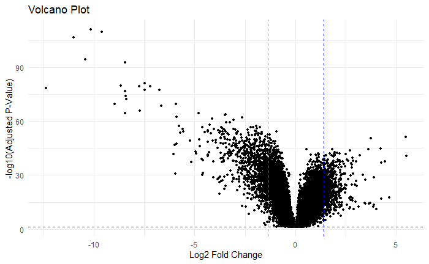
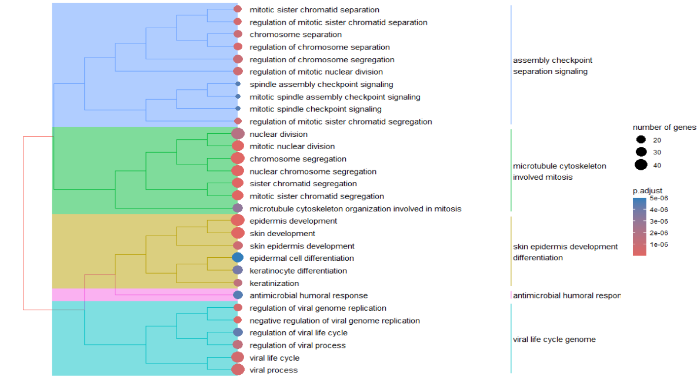
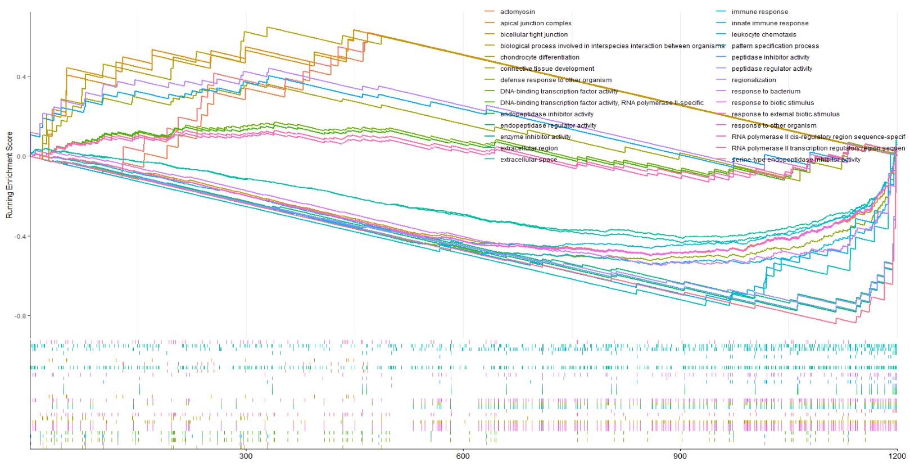
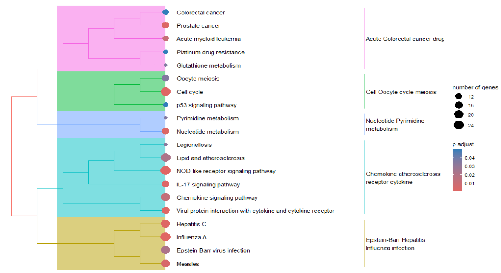

## Some alteration and data modification
Taking only the most significant genes.
(log P-value vs log fold change)

```R
# from the pre-processing tT2
All_gene <- tT2 #  (`tT2`) containing all genes

```


```R
All_gene$Log2FC <- (All_gene$logFC)/ log(2)
```
making Log2FC column

```R
library(org.Hs.eg.db)
entrez_ids <- mapIds(org.Hs.eg.db, keys = All_gene$Gene.symbol, keytype = "SYMBOL", column = "ENTREZID")
All_gene$entrez_ids <- entrez_ids

```
Adding entrez_ids for Functional analysis

### Filtering based on  adj.P.Val
```R
# keep only the significant genes
results_sig = subset(All_gene, adj.P.Val < 0.05)

print("All")
dim(All_gene)
print("significant genes")
dim(results_sig)
```
filtering only most significant genes

```R
colnames(results_sig)
```

##Rank and sorting

```R

#ranking  
results_sig$Rank_log_pval <- results_sig$Log2FC * -log10(results_sig$adj.P.Val)
# Sort the rank list based on the ranking
results_sig <- results_sig[order(results_sig$Rank_log_pval, decreasing = TRUE), ]
```
ranking and sorting is done for gsea analysis 

----


```R
library(ggplot2)
# Set the number of top positive and negative values you want to display
top_positive <- 500
top_negative <- 500

# Create a volcano plot with cutoff lines
ggplot(results_sig, aes(x = Log2FC, y = -log10(adj.P.Val))) +
  geom_point(size = 1) +
  geom_hline(yintercept = -log10(0.05), linetype = "dashed", color = "red") +  # Example significance threshold
  geom_vline(xintercept = results_sig$Log2FC[top_positive], linetype = "dashed", color = "blue") +
  geom_vline(xintercept = results_sig$Log2FC[length(results_sig$Log2FC) - top_negative], linetype = "dashed", color = "green") +
  labs(x = "Log2 Fold Change", y = "-log10(Adjusted P-Value)", title = "Volcano Plot") +
  theme_minimal()

```

#### volcano plot




### Filtering genes based on Log2 Fold chage
```R
# Set the number of top positive and negative values you want to subset
top_positive <- 500
top_negative <- 700

# Subset the top positive and top negative values
top_positive_subset <- results_sig[1:top_positive, ]
top_negative_subset <- results_sig[(nrow(results_sig) - top_negative + 1):nrow(results_sig), ]

# Combine the subsets into a new dataframe if needed
combined_subset <- rbind(top_positive_subset, top_negative_subset)

dim(combined_subset)
colnames(combined_subset)
```

###droping some columns
```R
# Drop columns by specifying the columns you want to keep
combined_subset <- combined_subset[, c("Gene.symbol", "Rank_log_pval", "adj.P.Val", "P.Value","entrez_ids", "Log2FC" )]
colnames(combined_subset)

```

---

# Functional Analysis:


```R
library(clusterProfiler)
library(org.Hs.eg.db)

```


### enrichgo
```R
res_enrichgo <-enrichGO(gene = combined_subset$entrez_ids,
         universe      = All_gene$entrez_ids,
         OrgDb         = org.Hs.eg.db,
         ont = "ALL",
         pAdjustMethod = "BH",
         pvalueCutoff  = 0.01,
         qvalueCutoff  = 0.05,
         readable      = TRUE)
```

##### Treeplot of GO pathway analysis
```R
treeplot(pairwise_termsim(res_enrichgo))
```



##### GSEA enrichment plot


```R
gsea_list <- combined_subset$entrez_ids
names(gsea_list) <- combined_subset$Rank_log_pval

res_gsea <- gseGO(gsea_list,
            OrgDb = org.Hs.eg.db,
            ont = "ALL")
```

```R
library(enrichplot)
gseaplot2(res_gsea, geneSetID = 1:30, subplots = 1:2)
```


GSEAplot of GO pathway showing enrichment genes in the terms

```R
res_enrichKEGG <- enrichKEGG(
          combined_subset$entrez_ids,
          organism = "hsa",
          pvalueCutoff = 0.05,
          pAdjustMethod = "BH",
          universe = All_gene$entrez_ids,
          keyType = "kegg"
          )

treeplot(pairwise_termsim(res_enrichKEGG))
```
##### **KEGG Pathway Analysis**: 
KEGG pathway analysis was performed to identify pathways enriched with DEGs, providing insights into the biological pathways affected by experimental conditions. A Treeplot was made based on KEGG pathway enrichment analysis.



----
