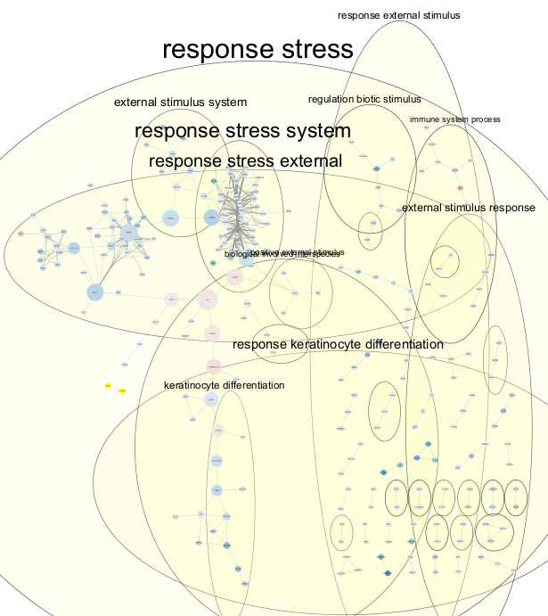
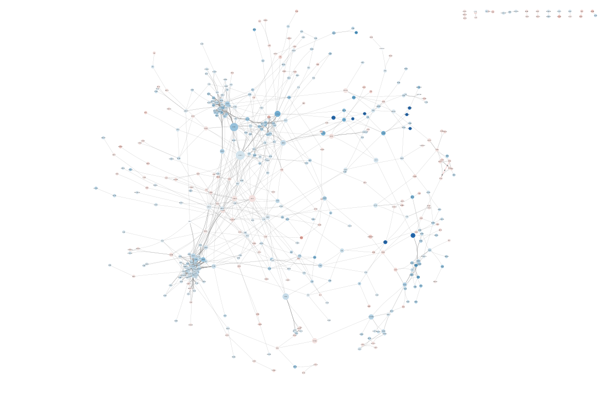
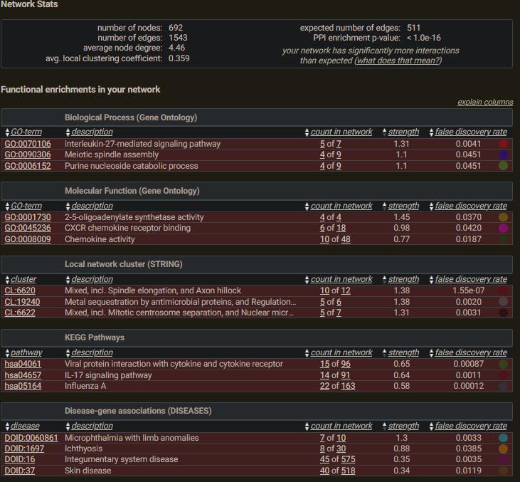
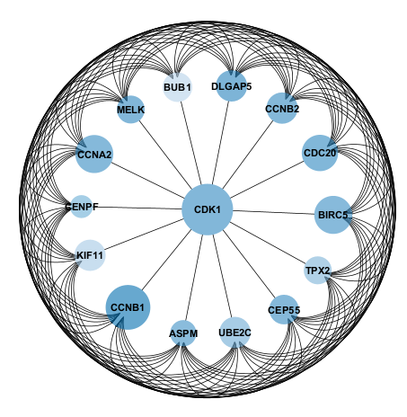
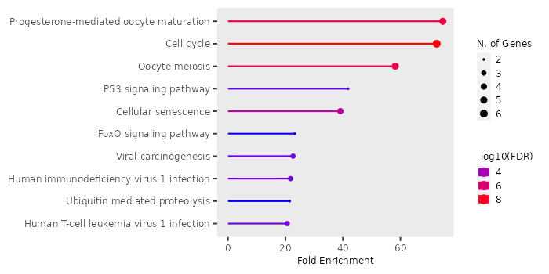
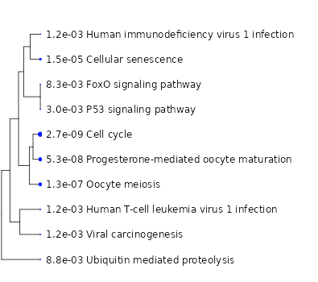
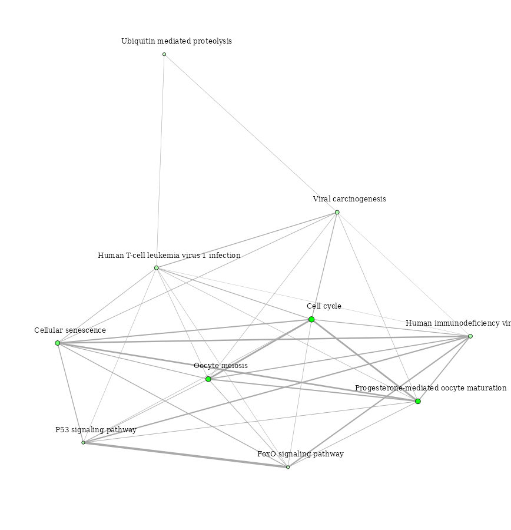

- **Network Analysis Tools**: Network analysis tools such as Cytoscape or STRING were utilized to construct and visualize protein-protein interaction networks of DEGs.
- **Key Functional Interactions**: Key functional interactions within the network were identified using topological algorithms such as degree centrality, betweenness centrality, and clustering coefficient.

**Figure : Protein-protein network with Pathway annotation

**Figure : Protein -protein network of the significant genes**
Sting database: The significant genes were analysied using Sting database for network analysis.
The minimum required interaction score of network edge confidence was set to be 0.700.

The Top pathways in the analysis were selected and uploaded into cytoscape for futher analysis.

Cytoscape visualization: -->
- The network from string database, the differential expression analysis from R and the Pathway analysis were loaded in the cytoscape.
- The disconnected and isolated nodes were removed .
- CentiScaPe (v2.2) app was used to calculate - Diameter, Average distance, Degree, radiality, Closeness, Stress, Betweenness, Centroid Value, Eccentricity, EigenVector, Bridging, Edge betweenness. set as undirected network.
- Auto Annotate app was used to annotate the pathways of the proteins.
- Radial layout
- jActiveModules app was used to find clusterswhere member nodes show significant changes in expression levels. Log2FC and adj.pvalue were provided. 
		jActiveModules is a Cytoscape plugin designed to identify expression-activated subnetworks within molecular interaction networks. These subnetworks represent connected regions of the network where there are significant changes in gene expression under specific conditions.
- 

Settings:
- Ripple style.
- Node -
	- Fill color - 'LoG2FC', continuous mapping- Blue for down regulated genes, red for upregulated.
	- size         -  "betweenness unDIr" -  continuous mapping
	- Border paint - "Degree unDir" - continuous mapping with purple cutoff at 39 (Top hub genes), and 
- Edges
	- Width - "combined score" - continuous size

##### Hub Gene identification:
The cytoHubba of the Cytoscape software was used to select the significant hub genes among the obtained DEGs. The Maximal Clique Centrality(MCC) method was used to select the top 10 genes of the PPI network. Then, we used a connectivity degree in the PPI network to evaluate the top 10 genes we just selected.
The results are

| Rank | Name | Score | Gene.title | Log2FC |
| ---- | ---- | ---- | ---- | ---- |
| 1 | CEP55 | 1.8 | centromere protein F | -2.5 |
| 1 | BIRC5 | 1.8 | baculoviral IAP repeat containing 5 | -2.5 |
| 1 | MELK | 1.8 | maternal embryonic leucine zipper kinase | -2.7 |
| 1 | KIF11 | 1.8 | kinesin family member 11 | -1.7 |
| 1 | ASPM | 1.8 | abnormal spindle microtubule assembly | -2.4 |
| 1 | CCNB2 | 1.8 | cyclin B2 | -2.6 |
| 1 | BUB1 | 1.8 | BUB1 mitotic checkpoint serine/threonine kinase | -1.6 |
| 1 | CDK1 | 1.8 | cyclin dependent kinase 1 | -2.7 |
| 1 | CCNA2 | 1.8 | cyclin A2 | -2.5 |
| 1 | CDC20 | 1.8 | cell division cycle 20 | -2.7 |
| 1 | UBE2C | 1.8 | ubiquitin conjugating enzyme E2 C | -2.0 |
| 1 | CCNB1 | 1.8 | cyclin B1 | -3.7 |
| 13 | KIF20A | 1.8 | kinesin family member 20A | -2.5 |
| 13 | CENPF | 1.8 | centromere protein F | -1.5 |
| 13 | TPX2 | 1.8 | TPX2, microtubule nucleation factor | -1.7 |

The top 15 Hub genes are high lighted with purple border node color.

**Figure : Top 15 Hub genes protein protein network**. Continuous mapping- blue color, size continuous mapping - Degree unDir

**Figure : Pathways that correspond to the Hub genes**

**Figure : Pathways that correspond to the Hub genes**

**Figure : Pathway network of the Hub genes**

----
